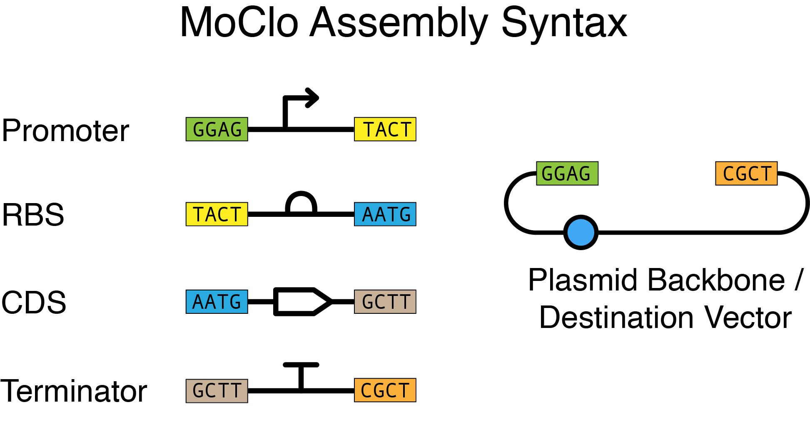

# Introduction to the DBTL Bootcamp

**The Introduction is currently under development.**

> You're brainstorming iGEM project ideas with your team. 
You're excited to voice a novel synthetic biology approach to detect early-stage cancers. 
You already have some of the DNA parts you would need in the distribution kit, and you can synthesize the rest. 
You even have the general genetic circuit design in mind, so let's start ordering!
> 
> But, your advisor asks that you take a step back. 
They ask how might you actually test the components of your design, what expectations about specificity can we make based on modeling, and how will you generate data that you can share and compare with other groups?
> 
> All of these questions might be a bit disappointing, as you're excited to start working in the lab. 
But there are so many tools and resources available to address these challenges, and the Design > Build > Test > Learn (DBTL) cycle can help you address these in a more systematic way.

 

First, what do we mean by a **bootcamp**? 
A “bootcamp” is a short, defined set of activities meant to help someone become familiar with or learn how to do larger related activities.

This iGEM Engineering Bootcamp will help you learn about the Design > Build > Test > Learn ([DBTL](https://technology.igem.org/engineering/introduction#h-the-engineering-cycle)) cycle that is important for engineering biological systems. 
This should serve as a brief introduction to designing and building genetic circuits. 
You will then be able to test your built genetic circuits and then analyze and learn from your experiment.

More specifically, the DBTL Bootcamp will take you through designing, building, testing, and analyzing characterization data for three green fluorescent protein (GFP) reporter constructs of varying promoter strength. 

Your iGEM project’s aim, DBTL cycle, as well as the tools and techniques used at each stage, will be more complex than this, but we hope you will find some useful approaches and tools that you can apply to your project.

_Note_, this is not coursework, nor a full course! 
You will need to have some knowledge in advance, seek more information yourself, and get used to some terminology that you may not be used to. 
Some of this we will cover in sections like _prerequisite knowledge_, and linking to additional resources. 
Others though, you may need to look up yourself.

Finally, as you proceed through the Bootcamp, if you have any questions or issues, you can reach out to us on the [iGEM Global Slack's](https://competition.igem.org/participation/connect#h-join-the-i-gem-global-slack) **#engineering channel**.

## What you should know before you start
Each module may have some prerequisite knowledge, but before beginning the DBTL Bootcamp, you should understand …
- gene expression in _E. coli_, and a parts-based approach to designing a [transcription unit](https://www.nature.com/scitable/definition/transcription-unit-260/) in a plasmid. 
This includes how a constitutive promoter, transcription, translation, etc, works. 
- how restriction enzyme assembly, and specifically how Golden Gate Assembly works. 
[Here](https://technology.igem.org/assembly/golden-gate) is a good refresher.

## Structure
Each stage of the DBTL cycle has been separated into modules. 
These modules are interconnected, for example, the output of your Design Module, will be the input for your Build Module. 
But you will also be able to use each module independently. 
We have provided all the files and the data that you will need to get started for each module in this repo. 
And the parts, plasmids, and fluorescence calibrants are all in your [2024 Distribution Kit](https://technology.igem.org/distribution/handbook)!

### What will you do in each module?
#### Design Module
In the [Design Module](/1_design/1_design.md), you will model the effect of constitutive promoter strength on GFP expression, and use design tools to _in silico_ assemble three GFP constructs using Golden Gate Assembly (GGA).
_No lab work is needed!_

#### Build Module
In the [Build Module](/1_build/1_build.md), you will assemble three GFP reporter constructs in the lab with Golden Gate Assembly. 
You will be introduced and taken through our recommended protocols required to do this. 
By the end of this module, you will have the physical samples of your constructs.

#### Test Module
In the [Test Module](/3_test/1_test.md), you will measure GFP expression with a plate reader. 
Using the constructs you assembled (or previous InterLab constructs) you will follow a protocol that will produce calibrated measurements of fluorescence. 

#### Learn Module
Finally, in the [Learn Module](/4_learn/4_learn.md), you will analyze the data produced in the Test Module.
You will use that data to inform your model, choose the right construct for your project's goals, and/or iterate on your initial designs.

## How do I get started?
The best way to start is to read through this documentation! 
Start with this Introduction, and review the summaries for each module within the Structure section. 
This will give you the best overview of what this Bootcamp offers, and where you might want to start. 
We do recommend starting with the [Design Module](/1_design/1_design.md) though!

### What exactly am I designing/building/testing/learning?
You will be assembling constitutively expressing GFP devices as a transcription unit in a plasmid. 
We have included introductions to the parts (constitutive promoters, RBS, CDS for GFP, and terminator) and the destination vector, below. 

## The Parts (& Plasmid)
We have provided the parts and their sequences needed to complete the DBTL Bootcamp, both as the **part** itself and as a **part in backbone**. 
These have all been added to the [iGEM Registry](https://parts.igem.org/) (Registry for short), so we have included links to their respective part pages. We will be using the [SBOL visual standard](https://sbolstandard.org/visual-about/) for representing designs, singular parts, and even interactions.

Here we will go over the function, constraints, and considerations related to these. 

We have ensured that everything is correct for these sequences and their associated samples, but it is also important to consider for yourself…
- _Is the part's sequence documented correctly?_
- _Will the sequence work for the assembly approach you have chosen?_
- _Is the sample of this part fully sequence confirmed?_

### Promoters: Anderson promoters 
The [Anderson promoter collection](https://parts.igem.org/Promoters/Catalog/Anderson) is a set of constitutive σ70 transcriptional promoters for protein expression in _E. coli_. 
Numerous iGEM teams and academic studies have included the Anderson promoters, and they are some of the most used and well-characterized parts in the Registry.

We will be using a subset of _five_ of these Anderson promoters.

| Part Name | Plasmid Backbone |
| --- | --- |
| [BBa_J23100](https://parts.igem.org/Part:BBa_J23100) | [pSB1C5SA](https://parts.igem.org/Part:pSB1C5SA) |
| [BBa_J23101](https://parts.igem.org/Part:BBa_J23101) | [pSB1C5SA](https://parts.igem.org/Part:pSB1C5SA) |
| [BBa_J23106](https://parts.igem.org/Part:BBa_J23106) | [pSB1C5SA](https://parts.igem.org/Part:pSB1C5SA) |
| [BBa_J23116](https://parts.igem.org/Part:BBa_J23116) | [pSB1C5SA](https://parts.igem.org/Part:pSB1C5SA) |
| [BBa_J23117](https://parts.igem.org/Part:BBa_J23117) | [pSB1C5SA](https://parts.igem.org/Part:pSB1C5SA) |

These five promoters have been used in previous [InterLaboratory studies](https://technology.igem.org/interlabs/introduction), and they cover a range of promoter strengths, from strong to weak. We will discuss these promoters further, including available data, in the [Design Module's](/1_design/1_design.md) Modeling section.

### RBS
The RBS you will be using is a variant of [BBa_B0034](https://parts.igem.org/Part:BBa_B0034), BBa_J428038. 

| Part Name | Plasmid Backbone |
| --- | --- |
| [BBa_J428038](https://parts.igem.org/Part:BBa_J428038) | [pSB1C5SB](https://parts.igem.org/Part:pSB1C5SB) |

A key difference here is that this variant also includes a 6bp downstream of the [Shine-Dalgarno](https://en.wikipedia.org/wiki/Shine%E2%80%93Dalgarno_sequence) sequence. 
Along with the Type IIS fusion site for CDS parts (`AATG`), this will create a 7bp spacer between the Shine-Dalgarno sequence and the `ATG`.

### CDS: Green Fluorescent Protein
The green fluorescent protein (GFP) you will be using is a Type IIS variant of [BBa_E0040](https://parts.igem.org/Part:BBa_E0040), BBa_J119040. 

| Part Name | Plasmid Backbone |
| --- | --- |
| [BBa_J119040](https://parts.igem.org/Part:BBa_J119040) | [pSB1C5SC](https://parts.igem.org/Part:pSB1C5SC) |

[BBa_E0040](https://parts.igem.org/Part:BBa_E0040) is the most commonly used GFP in the Registry. 
However, it contains a BsaI site within its sequence which makes it incompatible with the iGEM Type IIS assembly standard. 
The variant you are using, BBa_J119040, has a single base pair substitution (base 648) to remove the BsaI site by changing a `C` to a `T`.

[BBa_K2656022](https://parts.igem.org/Part:BBa_K2656022) is essentially the same part and has more documentation, but it includes the full `5’` fusion site for CDS parts (`AATG`), so we will be referring to BBa_J119040 as it is sequence-specific.

### Terminator
The terminator you will be using is a variant of [BBa_B0015](https://parts.igem.org/Part:BBa_B0015), BBa_J428092.

| Part Name | Plasmid Backbone |
| --- | --- |
| [BBa_J428092](https://parts.igem.org/Part:BBa_J428092) | [pSB1C5SD](https://parts.igem.org/Part:pSB1C5SD) |

[BBa_B0015](https://parts.igem.org/Part:BBa_B0015) is the most used terminator in the Registry. 
This variant includes a `5’ AA` sequence, that when taken with the `5’` fusion site for terminators (`GCTT`) would create a stop codon preceding the terminator (`5' GCT TAA BBa_B0015`).

 

### Plasmid backbone / Destination vector
The pTi plasmid backbone was developed by the [Federici Lab](https://federicilab.org/). 
It is a Kanamycin-resistant [uLoop](https://academic.oup.com/synbio/article/5/1/ysaa001/5727770) compatible (Golden Gate) plasmid backbone that is similar to the pET28a vector.

The [Reclone](https://reclone.org/) network has some very helpful [documentation and experience](https://forum.reclone.org/t/pti-plasmid-backbone/797/2) on the pTi plasmid.

We have incorporated the pTi plasmid into the Registry as pTi (BBa_J434150) paired with an RFP expressing dropout (BBa_J434151).

| Plasmid Backbone | Dropout |
| --- | --- |
| [BBa_J434150](https://parts.igem.org/Part:BBa_J434150) | [BBa_J434151](https://parts.igem.org/Part:BBa_J434151) |

For the [Design Module](/1_design/1_design.md), you will use the pTi plasmid backbone for _in silico_ assembly. 
For the [Build](/1_build/1_build.md) and [Test Module](/1_test/1_test.md), you will be assembling and expressing your constructs in the pTi plasmid backbone.  

## Golden Gate Assembly

For the DBTL Bootcamp, we will be using [Golden Gate Assembly](https://technology.igem.org/assembly/golden-gate). 
Specifically, the parts and destination vector you will be using will have the overhangs (fusion sites) that adhere to the MoClo and [iGEM Type IIS](https://technology.igem.org/assembly/igem-type-iis) assembly standards for building a transcription unit.

 

| 5' Fusion Site | Part Type | 3' Fusion Site |
| --- | --- | --- |
| GGAG | Promoter | TACT |
| TACT | RBS | AATG | 
| AATG | CDS | GCTT |
| GCTT | Terminator | CGCT |

As you look through the figure and table above you will notice that the fusion sites flank the part, but do not belong to the part itself. 

As an example, `GGAG` and `TACT` is not part of the sequence for the promoter BBa_J23101 (`TTTACAGCTAGCTCAGTCCTAGGTATTATGCTAGC`). However it will be the sequence 
flanking the sequence of BBa_J23101 for the **part in backbone**.

There is an exception here though. The `5’` CDS fusion site (`AATG`) can be considered just `A`, as the start codon (`ATG`) of a CDS will belong to its part sequence but also overlaps with the fusion site.
 
Finally, Golden Gate Assembly is an extremely powerful assembly technique and can be made more complex with hierarchical assemblies, where you would be able to assemble multiple transcription units to create larger genetic circuits. 
This may be a consideration for your own project which you will need to include in your Design process. 
But for this bootcamp, all you will need be prepared for is the above! 
