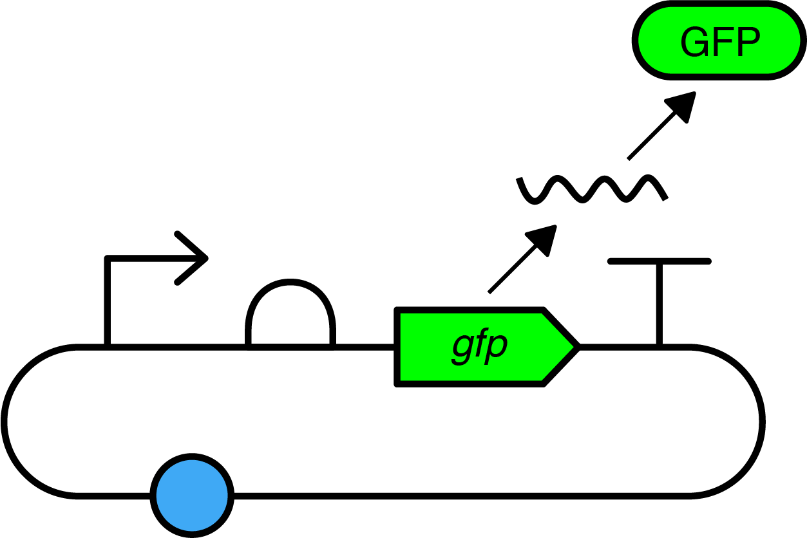
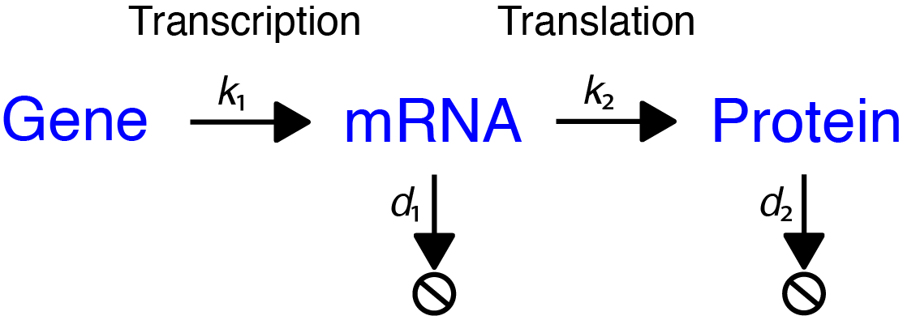

# Design Module
[Introduction](/0_intro/0_intro.md) >> [Design](/1_design/1_design.md) >> [Build](/2_build/2_build.md) >> [Test](/3_test/3_test.md) >> [Learn](/4_learn/4_learn.md)

**The Design Module is currently under development.**

## Overview
In this Design Module, you will start by modeling the effect of a set of constitutive promoters on GFP expression. 
You will then use the software tool of your choice to assemble _in silico_ three GFP reporter constructs with strong, medium, and weak promoter strength.

Before you start, you should read through our page on the [Design stage](https://technology.igem.org/engineering/design) of the [DBTL cycle](https://technology.igem.org/engineering/introduction). 
We will be repeating some of the key concepts and considerations and applying them to this Design Module, but that resource will include more material than is covered here.

We have provided all the files and the data that you will need to get started. 
The software tools to do this will be up to you (although we have some guidance on some specific tools). 
You will be able to check the outputs of your work in the modeling and _in silico_ assembly sections against the validation files we have provided. 

### Outline
- The design goal
- Modeling
- Assemble your constructs _in silico_
- Storing, Sharing, and Presenting your Constructs

### What you will need to know before you start
- Anything covered in the [Introduction](/0_intro/0_intro.md)!
- Familiarity with plasmid maps, specifically those produced from GenBank files. 

### Resources needed
1. Computer and internet access
2. Modeling tool(s): You will be using this to model the behavior of different promoters on GFP expression
3. Design tool(s): You will be using this to import parts and plasmids, design your constructs, and assemble your constructs
4. Parts and plasmid files (provided in this repo [here](/genbank_files/))
5. Anderson Promoter data sets (provided below)

## The Design goal
In the Design stage of the DBTL cycle, it helps to outline your design goal, including what is required to meet the aims of your project and then use this to guide your design.

For this bootcamp we have defined the **aim**: to design, and build three GFP reporter constructs and test the effect of constitutive promoter strength on GFP expression.

It is always helpful to *diagram* out a process,, starting with some abstraction. 
By having a diagram that shows the aim, and the steps to get there, you will have a resource that can be used to track your progress and to ensure that all the considerations that were made in the Design phase will be done in the Build and Test phases.

<figure>

</figure>

We will start with a simple diagram of a generalized GFP reporter construct.
Here we have our transcription unit: the constitutive promoter, rbs, GFP CDS, and terminator, in a plasmid backbone (reminder, we're using [SBOL Visual](https://sbolstandard.org/visual-about/) for representing genetic designs).  

But let us consider some of the **requirements** that need to be addressed to meet your aim, and how those may affect other stages of the DBTL cycle and vice-versa.
- What are the parts you should use for your constructs? What do you have available, and what do you need to procure?
- How can you model the performance of the desired function and how the parts will work together?
- How will you build these constructs? How will your build plan influence your designs?
- What chassis will you be using? Even more specific, what strain you will be using?
- Once built, how will you test and measure the function of your constructs? What will be your positive and negative controls? 

You will address some of these questions throughout the bootcamp, including some of the self-imposed constraints we have in place. 
- The parts we have selected are well-characterized and we will go into more detail about them in the Parts section below.
- You will model the effect of constitutive promoters on GFP expression
- You will build these constructs with parts available in the iGEM Distribution Kit. All of the basic parts in the Kit are in a Type IIS Assembly format, so you will be using Golden Gate Assembly. 
- The plasmid backbone with drop-out, and the parts you are using have all been designed for and/or tested in _E. coli_. 
- You are building constructs for GFP expression, so you will be testing and measuring them by measuring fluorescence in a plate reader. For controls, we have provided a positive and negative control. And for calibrants, you can learn more about those in the Test Module!

However, for your project you will likely have different answers to all of these questions. Maybe you are working in _S. cerevisiae_, or you will be using synthesis for your entire constructs. 

### The Design constraints
As mentioned above, there are some design constraints to keep things simple, as this ensures everyone has access to the same materials, and that you will be able to model and validate your constructs against known products.
These constraints include:
1. **Parts and plasmids:** A selection from the 2024 iGEM Distribution Kit
2. **Assembly:** Golden Gate Assembly
3. **Chassis:** _E. coli_ DH5a, DH10b strains are recommended, but use what is available in your lab
4. **Measurement:** GFP fluorescence

If you are feeling adventurous, feel free to go beyond these constraints, but there will not be material to help troubleshoot.

### Knowledge check
All caught up? You should be able to answer these questions before proceeding further.
1. What is the purpose of your design?
2. What will be the function of your engineered biological system?
3. How will you build your design?
4. How will you test the function of your design?
5. What will your experimental data look like if the design is working as intended? 
What will the data look like if the design was built incorrectly?

## Anderson Promoter Data

Before we start modeling expression, we will look at some previous data on the strength of the Anderson promoters.

| Anderson Promoter | RFP (AU) | Relative Strength |
| --- | --- | --- |
| BBa_J23100 | 2547 | 1.00 |
| BBa_J23101 | 1791 | 0.70 |
| BBa_J23106 | 1185 | 0.47 |
| BBa_J23116 | 396 | 0.16 |
| BBa_J23117 | 162 | 0.06 |

The data above is a subset of a larger characterization effort by the [2006 Berkeley iGEM Team](https://2006.igem.org/wiki/index.php/University_of_California_Berkeley_2006).
From this data, you can already see which promoters are the highest (BBa_J23100) and lowest (BBa_J23117) strength.

We will use this data to [model]() the effect of all five promoters on GFP expression, but we should consider and address some important questions!

### What exactly do we mean by promoter strength?
By promoter strength, we mean the effect on transcription rate: a strong promoter would increase the transcription rate and, presumably, the expression of a protein.

In the data above, promoter strength was measured through RFP fluorescence (AU).

### What does AU mean for the RFP measurements?
AU stands for an **A**rbitrary **U**nit and it is a relative unit of measurement.
This works OK when we are only comparing measurements performed in the same experiment, but we are not actually able to compare these measurements from lab to lab.

We will have more on this in our Test Module, but a key thing to consider even before you start your designing is how will you ensure you can share and compare your data.

### What do we know about the experimental context?
From the [Anderson promoter collection page](https://parts.igem.org/Promoters/Catalog/Anderson), the individual part pages, and some sequence analysis, we know the following:
- Red fluorescent protein (RFP) was used as the reporter protein to measure expression

- the promoters were measured in the [BBa_J61002](https://parts.igem.org/Part:BBa_J61002) plasmid backbone. 
    - BBa_J61002 is a modified version of [pSB1A2](https://parts.igem.org/Part:pSB1A2), a high-copy, ampicillin resistant plasmid backbone.

- BBa_J61002 includes an expression cassette. Users clone in their promoter, and then downstream there is an RBS (BBa_B0034), an RFP (BBa_E1010), and a Terminator (BBa_B0015).

- the _E. coli_ TG1 strain was used

### What do we _not_ know about the experimental context?
Importantly, we also do not know the following (at least readily):
- how was fluorescence measured? Including what instrument was used?
- what protocol was used?
- what controls were used?

## Modeling 

A model is a mathematical abstraction (or somplification) that allows us to describe a system.

It gives use a clear idea of the inputs and outputs

It helps us predict the behavior of a systm

And will let us analyze data by comparing real world data to the model.

This is particularly useful to idenity behavior that we may not have considered

 use what we know about the Anderson promoters and model their effect on GFP expression.

<figure>

</figure>

<figure>

</figure>

After that, you will select two promoters plus BBa_J23106 (our default) to use in your constructs.
Our recommendation is to select promoters that would be expected to be higher and lower strength.

Maybe in your project you are working with a protein that _may_ increase cellular burden. You would want to test the optimal level of expression that you can get, so testing expression across a range of promoter strengths would be useful.

### Validate/check your model

### Storing, Sharing, and Presenting

### Knowledge check
1. What is the purpose of your model?
2. What will be the output of your model?
3. Which parameters and/or libraries will be required to implement your model?
4. How well are these parameters characterized or described in literature? How well documented are the tools/libraries you are using?
5. How will you test the function of your model?
6. What will your simulation data look like if the model is working as intended?

### Additional Resources
- Webinar: [Modeling for SynBio: from ODEs to Gene expression](https://video.igem.org/w/nPrjzXYqVpAxRjCRCx4Mi9)

## Assemble your constructs _in silico_
Based on your modeling, you have selected the two promoters (one strong and one weak) along with BBa_J231006, which you will use as your medium strength promoter. 
You will now assemble constructs _in silico_ (digitally, in the computer) for all three. 
At the end of this section, you will have produced your constructs as plasmid maps and be able to validate them against our files.

There are several different tools available to design and assemble your constructs, and many of them have several features beyond assembling DNA _in silico_ (Electronic lab notebooks, modeling, sample tracking, etc). 
Your lab may have a recommended tool, or you may have one that you already like. 
Even with a new tool, you can learn its different features at your own pace, while also reading through its documentation.

For the purposes of this bootcamp though, we have provided basic guidance for two different workflows that use different tools to cover designing, assembling, and validating constructs _in silico_.

Please note, that these software tools may have updates over time that will make some of the material in these workflows outdated.

We have generalized the guidance into the following steps:
1. **Import your files:** 
No matter what design tool you are using, you will need to tell it what parts (and information) you want to use. 
This may include uploading genbank files of your parts/plasmids, using an API that links directly to a database, or a spreadsheet!
2. **Part verification:** 
Once you have selected the parts/plasmids you will be using, you will verify everything is correct. 
Will there be any issues with the assembly method you will be using? 
Are these parts what they say they are? 
This may be a manual process, or an automated one.
3. **Assemble _in silico_:** 
With your parts and plasmid backbone verified, you will assemble your constructs _in silico_. 
This will provide insight into what you will actually build during the Build module, and may uncover any issues.  
4. **Validate your constructs:** 
You will validate that your _in silico_ assembly sequences are correct. 
This is possible because we have clearly defined inputs and processes, which will produce a predictable result.
5. **Export your constructs:** 
You will want to export and share your designs, whether for collaboration, publication, or additional workflows.

### Design Tool Workflows
- [Benchling](/1_design/benchling-design-workflow) 
- TBD: Kernel from Asimov

## Storing, Sharing, and Presenting your Constructs

For the purposes of the iGEM Competition, you must document your parts and constructs on the iGEM Registry. 
But, this is not a tutorial for how to use the iGEM Registry! 
You should follow the requirements and process for this through the [competition deliverables](https://competition.igem.org/deliverables/part-pages) for part pages.

Once you have followed a workflow and produced and validated your _in silico_ assemblies, you are ready to proceed on to the [Build Module](/2_build/2_build.md). 

In the Build Module, you will use the part and plasmid samples from the [iGEM Distribution Kit](https://technology.igem.org/distribution/introduction) to assemble your constructs in the lab, and you will use your _in silico_ assemblies as the reference sequences when you sequence those assemblies.