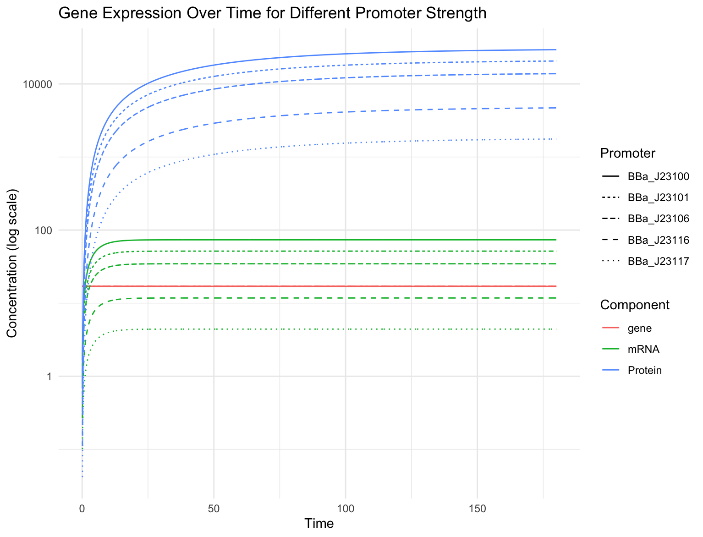

# Design Module
[Introduction](/0_intro/0_intro.md) >> [Design](/1_design/1_design.md) >> [Build](/2_build/2_build.md) >> [Test](/3_test/3_test.md) >> [Learn](/4_learn/4_learn.md)

**The Design Module is currently under development.**

## Overview
In this Design Module, you will start by modeling the effect of a set of constitutive promoters on GFP expression. 
You will then use the software tool of your choice to assemble _in silico_ three GFP reporter constructs with strong, medium, and weak promoter strength.

Before you start, you should read through our page on the [Design stage](https://technology.igem.org/engineering/design) of the [DBTL cycle](https://technology.igem.org/engineering/introduction). 
We will repeat some of the key concepts and considerations and apply them to this Design Module, but that resource will include more material than is covered here.

We have provided all the files and the data that you will need to get started. 
The software tools to do this will be up to you (although we have some guidance on some specific tools). 
You can check the outputs of your work in the modeling and _in silico_ assembly sections against the validation files we have provided. 

### Outline
- The design goal
- Modeling
- Assemble your constructs _in silico_
- Storing, Sharing, and Presenting your Constructs

### What you will need to know before you start
- Anything covered in the [Introduction](/0_intro/0_intro.md)!
- Familiarity with plasmid maps, specifically those produced from GenBank files. 

### Resources needed
1. Computer and internet access
2. Modeling tool(s): You will use this to model the behavior of different promoters on GFP expression
3. Design tool(s): You will use this to import parts and plasmids, design your constructs, and assemble your constructs
4. Parts and plasmid files (provided in this repo [here](/genbank_files/))
5. Anderson Promoter data sets (provided below)

## The Design goal
In the Design stage of the DBTL cycle, it helps to outline your design goal, including what is required to meet the aims of your project and then use this to guide your design.

For this bootcamp we have defined the **aim**: to design, and build three GFP reporter constructs and test the effect of constitutive promoter strength on GFP expression.

It is always helpful to *diagram* out this process, starting with some abstraction. 
By having a diagram that shows the aim, and the steps to get there, you will have a resource that can be used to track your progress and to ensure that all the considerations that were made in the Design phase will be done in the Build and Test phases.

<figure>

</figure>

We will start with a simple diagram of a generalized GFP reporter construct.
Here we have our transcription unit: the constitutive promoter, rbs, GFP CDS, and terminator, in a plasmid backbone (reminder, we're using [SBOL Visual](https://sbolstandard.org/visual-about/) for representing genetic designs).  

But let us consider some of the **requirements** that need to be addressed to meet your aim, and how those may affect other stages of the DBTL cycle and vice-versa.
- What are the parts you should use for your constructs? What do you have available, and what do you need to procure?
- How can you model the performance of the desired function and how the parts will work together?
- How will you build these constructs? How will your build plan influence your designs?
- What chassis will you be using? Even more specific, what strain will you use?
- Once built, how will you test and measure the function of your constructs? What will be your positive and negative controls? 

You will address some of these questions throughout the bootcamp, including some of the self-imposed constraints we have in place. 
- The parts we have selected are well-characterized and we will go into more detail about them in the Parts section below.
- You will model the effect of constitutive promoters on GFP expression.
- You will build these constructs with parts available in the iGEM Distribution Kit. All of the basic parts in the Kit are in a Type IIS Assembly format, so you will use Golden Gate Assembly. 
- The plasmid backbone with drop-out, and the parts you are using have all been designed for and/or tested in _E. coli_. 
- You are building constructs for GFP expression, so you will test them by measuring fluorescence in a plate reader. For controls, we have provided a positive and negative control. And for calibrants, you can learn more about those in the Test Module!

However, for your project, you will likely have different answers to all of these questions. Maybe you are working in _S. cerevisiae_, or you will use synthesis for your entire constructs. 

### The Design constraints
As mentioned above, there are some design constraints to keep things simple, as this ensures everyone has access to the same materials, and that you can model and validate your constructs against known products.
These constraints include:
1. **Parts and plasmids:** A selection from the iGEM Distribution Kit
2. **Assembly:** Golden Gate Assembly
3. **Chassis:** _E. coli_ DH5a, DH10b strains are recommended, but use what is available in your lab
4. **Measurement:** GFP fluorescence

If you are feeling adventurous, feel free to go beyond these constraints, but there will not be material to help troubleshoot.

### Knowledge check
All caught up? You should be able to answer these questions before proceeding further.
1. What is the purpose of your design?
2. What will be the function of your engineered biological system?
3. How will you build your design?
4. How will you test the function of your design?
5. What will your experimental data look like if the design is working as intended? 
What will the data look like if the design was built incorrectly?

## Anderson Promoter Data

Before we start modeling GFP expression, we will look at some previous data on the strength of the Anderson promoters.

| Anderson Promoter | RFP (AU) | Relative Strength |
| --- | --- | --- |
| BBa_J23100 | 2547 | 1.00 |
| BBa_J23101 | 1791 | 0.70 |
| BBa_J23106 | 1185 | 0.47 |
| BBa_J23116 | 396 | 0.16 |
| BBa_J23117 | 162 | 0.06 |

The data above is a subset of a larger characterization effort by the [2006 Berkeley iGEM Team](https://2006.igem.org/wiki/index.php/University_of_California_Berkeley_2006).
From this data, you can already see which promoters are the highest (BBa_J23100) and lowest (BBa_J23117) strength.

We will use this data to [model](#modeling) the effect of all five promoters on GFP expression, but we should consider and address some important questions!

### What exactly do we mean by promoter strength?
By promoter strength, we mean the effect on transcription rate: a strong promoter would increase the transcription rate and, presumably, the expression of a protein.

In the data above, promoter strength was measured through RFP fluorescence (AU).

### What does AU mean for the RFP measurements?
AU stands for an **A**rbitrary **U**nit and it is a relative unit of measurement.
This works OK when we are only comparing measurements performed in the same experiment, but we are not actually able to compare these measurements from lab to lab.

We will have more on this in our [Test Module](/3_test/3_test.md), but a key thing to consider even before you start your designing is how you will ensure you can share and compare your data.

### What do we know about the experimental context?
From the [Anderson promoter collection page](https://parts.igem.org/Promoters/Catalog/Anderson), the individual part pages, and some sequence analysis, we know the following:
- Red fluorescent protein (RFP) was used as the reporter protein to measure expression.

- The promoters were measured in the [BBa_J61002](https://parts.igem.org/Part:BBa_J61002) plasmid backbone. 
    - BBa_J61002 is a modified version of [pSB1A2](https://parts.igem.org/Part:pSB1A2), a high-copy, ampicillin-resistant plasmid backbone.

- BBa_J61002 includes an expression cassette. Users clone in their promoter, and then downstream there is an RBS (BBa_B0034), an RFP (BBa_E1010), and a Terminator (BBa_B0015).

- The _E. coli_ TG1 strain was used

### What do we _not_ know about the experimental context?
Importantly, we also do not know the following (at least readily):
- How was fluorescence measured? Including, what instrument was used?
- What protocol was used?
- What controls were used?

A standard protocol that is widely used and easy to cite, would be beneficial in this case. We will have more on this in our [Test Module](/3_test/3_test.md)
.

## Modeling 

>**Note:** In this section, we will not delve too deep into the mathematics of modeling, instead we will demonstrate why modeling is important and useful. We have linked to some additional resources below that will cover modeling more extensively.

A model is a mathematical abstraction (or simplification) that allows us to describe a system.

Modeling our devices will demonstrate that we have a clear understanding of their inputs and outputs, and help us predict their behavior.
Additionally, when we have real-world data, we can compare that to the model, and potentially identify behavior that we may not have considered.

### Why you should model first
First let's see just some of the reasons why modeling is a great first step in the design stage:

- **Predictive Insights and Optimization:** 
Models simulate how a biological system will behave under various conditions. 
Synthetic biologists can adjust and test multiple variables quickly to simulate different scenarios and anticipate potential outcomes. 
This allows for optimizing genetic constructs for desired traits, and reduces the time and resources spent on less effective designs and experimentation.
- **Understanding Complex and Dynamic Systems:** 
Models provide insights into the complex and dynamic behavior of biological systems, such as gene expression patterns, protein interactions, and metabolic fluxes. 
Understanding these sometimes complex dynamics is crucial for designing systems that behave predictably across different conditions.
Hypothesis Testing and Guided Experimentation: Models enable researchers to test hypotheses by modifying specific components and interactions, helping to design experiments that focus on key variables and optimal conditions, improving the efficiency of the experimental phase.
- **Hypothesis Testing and Guided Experimentation:** 
Models allow for testing hypotheses about how biological systems function. 
Synthetic biologists can explore the effects of modifying specific components or interactions within the system, gaining a deeper understanding of the underlying biology.
This process can also identify key variables and suggest optimal experimental conditions, which aids in experimental design that focuses on the most informative and impactful tests, improving the efficiency and effectiveness of the experimental phase.
- **Standardization and Reproducibility:** 
Models provide a clear, quantitative description of system designs and expected behaviors, which are easy to communicate. 
Standardized models also serve as a reference for reproducing experiments and verifying results across different laboratories.
- **Educational Tool:** 
Models serve as excellent educational tools, providing a visual and interactive way to understand and manipulate biological systems. 

### Getting started: Biochemical reactions

Constitutive gene expression is the simplest gene expression to model. 
At all times gene expression is on at the same rate (this is of course an oversimplification of reality, but that's part of modeling!). 

<figure>

</figure>

Let's start with our initial diagram of our device.
The key reactions here are: 
- **Transcription:** the constitutive promoter will drive transcription of a gene (an rbs and _gfp_ coding region), producing mRNA at a constant rate, which we'll define as (k1)
- **Translation:** the mRNA will then be translated to produce the GFP protein at a constant rate, which we'll define as (k2)

<figure>

</figure>

Finally, we also know that there is some rate of degradation, both for the mRNAs and proteins, which we will define as (d1) and (d2), respectively.

Of course, there are some complexities here that we have ignored here for the simplicity of our model. 
These may include parameters like the stability/burden of the plasmid and device, the availability of RNA polymerases and ribosomes, and even cell division.

### ODEs and Law of Mass Action
We will use [ordinary differential equations](https://en.wikipedia.org/wiki/Ordinary_differential_equation) (ODEs) to model our system and applying the [law of mass action](https://en.wikipedia.org/wiki/Law_of_mass_action) ([webinar](https://www.youtube.com/watch?v=ph5iYWwXsPw&t=359s)), which states that the rate of a reaction is proportional to the product of the concentrations of the reactants, to our ODE. 

This allows us to predict how the concentration of a molecular species like our mRNA and protein changes over time. 

We will take our diagram from the previous section, break it down by reaction (transcription and translation), and write a simple mathematical model for each reaction.

#### Transcription and mRNA degradation

<figure>

</figure>

We have our reactant, $Gene$, that will be transcribed into our product, $mRNA$, at a reaction rate $k_{1}$.

In this case our $Gene$ is a constant which will be defined by the copy number of the plasmid.

Since we are modeling constitutive expression, we can define $k_{1}$ as the transcription rate regulated by the promoter: specifically, the promoter's ability to recruit RNA polymerase to start transcription.
This is tightly related to the sequence of the promoter, so once we have our model, if we want to increase $k_{1}$ we would use a strong promoter, and to decrease $k_{1}$ we would use a weak one.

We denote the derivative for the rate of change of mRNA over time as: 
$$\frac{d[mRNA]}{dt}$$

And, we have our: 
- reactant: $Gene$
- reaction rate: $k_{1}$
- product: $mRNA$

$$
\frac{d[mRNA]}{dt} = k_{1}{[Gene]}
$$
In simple terms, the rate of change of mRNA over time is proportional to the transcription rate ($k_{1}$) and the amount of genes we have.

We also know that there is a degradation of the mRNA, which is happening at rate ($d_{1}$) to the concentration of mRNA.

<figure>

</figure>

$$
\frac{d[mRNA]}{dt} = k_{1}{[Gene]} - d_{1}{[mRNA]}
$$

The rate of degradation is a negative term, and with that consideration we have: the rate of change of mRNA over time is proportional to the transcription rate ($k_{1}$) of genes minus the degradation rate ($d_{1}$) of the current concentration of mRNA.

#### Translation and Protein degradation

Similarly, we will do the same for modeling protein synthesis.

<figure>

</figure>

We have the $mRNA$ that will be translated into $Protein$, at rate $k_{2}$.

We can define $k_{2}$ as the translation rate regulated by the ribosome binding site (rbs): specifically, the rbs's ability to recruit ribosomes for translation.
Like a constitutive promoter, this is tightly related to the sequence of the rbs.
While we are not varying rbs strength in this bootcamp, once we have our model, if we want to increase $k_{2}$ we would use a strong rbs, and to decrease $k_{2}$ we would use a weak one.

We will start with a derivative for the rate of change of GFP protein over time.
This will be denoted as: 
$$\frac{d[Protein]}{dt}$$

And, we have our: 
- reactant: $mRNA$
- reaction rate: $k_{2}$
- product: $Protein$

And subsequently a degradation of that protein
- reactants: $Protein$
- degradation rate: $d_{2}$

$$
\frac{d[Protein]}{dt} = k_{2}{[mRNA]} - d_{2}{[Protein]}
$$

The rate of change of protein over time is proportional to the translation rate ($k_{2}$) of mRNA minus the degradation rate ($d_{2}$) of the current concentration of protein.

#### Our system

Altogether, we can model our system as follows:

<figure>

</figure>

$$
\frac{d[mRNA]}{dt} = k_{1}{[Gene]} - d_{1}{[mRNA]}
$$

$$
\frac{d[Protein]}{dt} = k_{2}{[mRNA]} - d_{2}{[Protein]}
$$

### Using your model
We can use the model with some parameters and states and write a script to graph its behavior. 
You can see an example of this from a [previous iGEM webinar](https://youtu.be/K0P1KVk_hDo?si=5K72owA1k8SNi9u7&t=1046), from which we will also pull some parameters and states.

States / Initial Conditions
- gene (copy number of plasmid )= 17
- mRNA = 0
- Protein = 0

Parameters
- k1 (transcription rate) = 1.19
- d1 (mRNA degradation rate) = log(2)/3
- k2 (translation rate) = 8.23
- d2 (protein degradation rate) = 0.02

<figure>

</figure>

### Modeling (and selecting) your promoters
We will use the same parameters and states as our example above, but now we can use our initial promoter strength data to model the behavior of all of our Anderson promoters.

States / Initial Conditions
- gene (copy number of plasmid )= 17
- mRNA = 0
- Protein = 0

Parameters
- k1 (transcription rate) = _see table_
- d1 (mRNA degradation rate) = log(2)/3
- k2 (translation rate) = 8.23
- d2 (protein degradation rate) = 0.02

For our k1 values, we will use the relative strength of our promoters :

| Anderson Promoter | RFP (AU) | Relative Strength |
| --- | --- | --- |
| BBa_J23100 | 2547 | 1.00 |
| BBa_J23101 | 1791 | 0.70 |
| BBa_J23106 | 1185 | 0.47 |
| BBa_J23116 | 396 | 0.16 |
| BBa_J23117 | 162 | 0.06 |

<figure>

</figure>

> We have an interactive version of the model as a [shiny app](https://dbtlbootcamp.shinyapps.io/con_exp/).
We have pre-populated the values for parameters and states, but you can choose different ones to see how the output changes. **Note:** This app is currently in a draft state, and subject to change.

Based on the model output, you can select your strong, medium, and weak strength promoters.
While you can select any of the three, we recommend selecting BBa_J23106 as your medium strength promoter, and then selecting your preferred strong and weak promoters.

With your selection, you can now proceed to the next step, assembling your constructs _in silico_.

From our Test and Learn Modules we can compare the real world data from our constructs to see how closely they fit our model. 
Keep in mind that we will measure fluorescence (protein expression) and not the rate of mRNA transcription nor the copy number of our plasmid.

### Knowledge check
1. What is the purpose of your model?
2. What will be the output of your model?
3. Which parameters and/or libraries will be required to implement your model?
4. How well are these parameters characterized or described in literature? How well documented are the tools/libraries you are using?
5. How will you test the function of your model?
6. What will your simulation data look like if the model is working as intended?

### Additional Resources
- Webinar: [Modeling for SynBio: from ODEs to Gene expression](https://video.igem.org/w/nPrjzXYqVpAxRjCRCx4Mi9)
- [Matlab Live script for the ODEs](./const_expression_ODE.mlx)
- [Python Notebook for the ODEs](./const_expression_ODE.ipynb)
- [R script for the ODEs](./const_expression_ODE.R)

## Assemble your constructs _in silico_
Based on your modeling, you have selected the two promoters (one strong and one weak) along with BBa_J231006, which you will use as your medium strength promoter. 
You will now assemble constructs _in silico_ (digitally, in the computer) for all three. 
At the end of this section, you will have produced your constructs as plasmid maps and be able to validate them against our files.

There are several different tools available to design and assemble your constructs, and many of them have several features beyond assembling DNA _in silico_ (Electronic lab notebooks, modeling, sample tracking, etc). 
Your lab may have a recommended tool, or you may have one that you already like. 
Even with a new tool, you can learn its different features at your own pace, while also reading through its documentation.

For the purposes of this bootcamp though, we have provided basic guidance for two different workflows that use different tools to cover designing, assembling, and validating constructs _in silico_.

Please note, that these software tools may have updates over time that will make some of the material in these workflows outdated.

We have generalized the guidance into the following steps:
1. **Import your files:** 
No matter what design tool you are using, you will need to tell it what parts (and information) you want to use. 
This may include uploading genbank files of your parts/plasmids, using an API that links directly to a database, or a spreadsheet!
2. **Part verification:** 
Once you have selected the parts/plasmids you will use, you will verify everything is correct. 
Will there be any issues with the assembly method you will use? 
Are these parts what they say they are? 
This may be a manual process, or an automated one.
3. **Assemble _in silico_:** 
With your parts and plasmid backbone verified, you will assemble your constructs _in silico_. 
This will provide insight into what you will actually build during the Build module, and may uncover any issues.  
4. **Validate your constructs:** 
You will validate that your _in silico_ assembly sequences are correct. 
This is possible because we have clearly defined inputs and processes, which will produce a predictable result.
5. **Export your constructs:** 
You will want to export and share your designs, whether for collaboration, publication, or additional workflows.

### Design Tool Workflows
- [Benchling](./benchling-design-workflow.md) 
- Kernel from [Asimov](https://www.asimov.com/): While not dedicated to this DBTL Bootcamp, Asimov has a Kernel [webinar](https://video.igem.org/w/mYnmcrQjQJxJtyf1kzT1KW), _Mastering genetic design, a case study with Kernel_, that covers this topic, and would enable you to create these constructs _in silico_.
- Open source option (TBD)

## Storing, Sharing, and Presenting your Constructs

For the purposes of the iGEM Competition, you must document your parts and constructs on the iGEM Registry. 
But, this is not a tutorial for how to use the iGEM Registry! 
You should follow the requirements and process for this through the [competition deliverables](https://competition.igem.org/deliverables/part-pages) for part pages.

## Build Module
Once you have followed a workflow and produced and validated your _in silico_ assemblies, you are ready to proceed on to the [Build Module](/2_build/2_build.md). 

In the Build Module, you will use the part and plasmid samples from the [iGEM Distribution Kit](https://technology.igem.org/distribution/introduction) to assemble your constructs in the lab, and you will use your _in silico_ assemblies as the reference sequences when you sequence those assemblies.
