# Benchling Workflow
## Assemble _in silico_
With your parts verified, you can now move on to assembling them _in silico_. There are a few ways to do this but we will use the following workflow.

While in your folder `[+]` >> `DNA/RNA sequence` >> `Assemble DNA sequences by cloning`. The window below will pop up.

 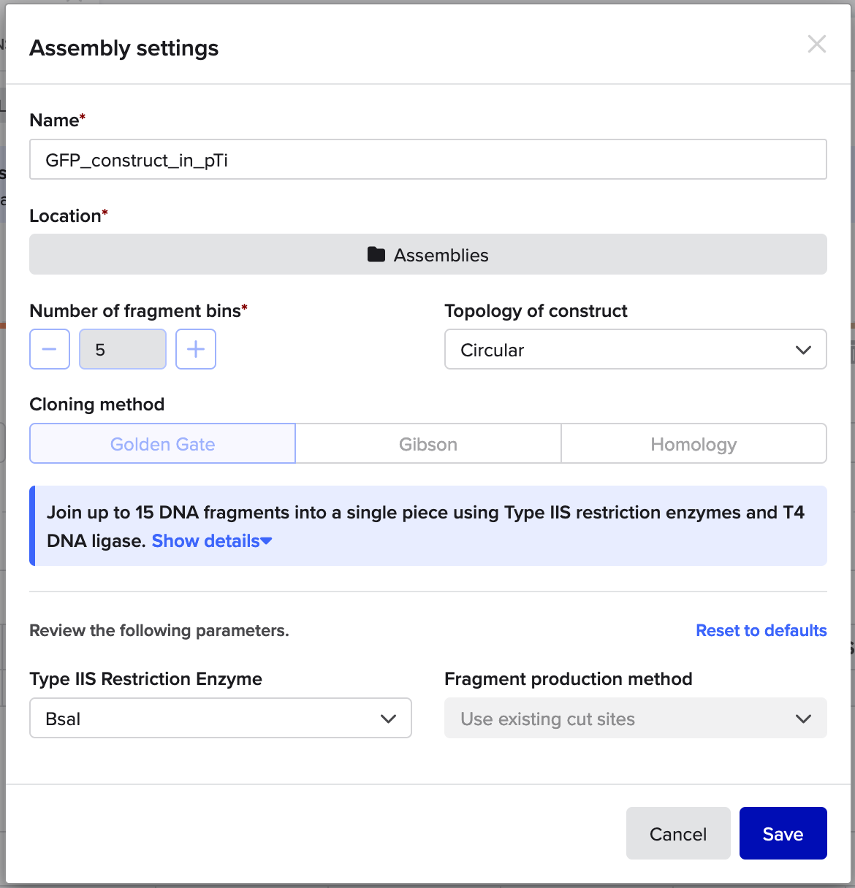
1. Prepare the **Assembly settings** as follows:
    - Start by naming your assembly record `GFP_constructs_in_pTi`. This will be the name of the _record_ of the _in silico_ assembly, **not** the name of the assemblies (constructs) that are produced.
    - Choose your `Assemblies` folder as the **Location** to save your assembled constructs and the assembly record
    - Select `5` for **Number of fragment bins** (1 for the Destination Vector, 4 for the basic parts)
    - Select `Circular` as the **Topology of construct**
    - Select `Golden Gate` as the **Cloning method**, and `BsaI` as the **Type IIS Restriction Enzyme**

 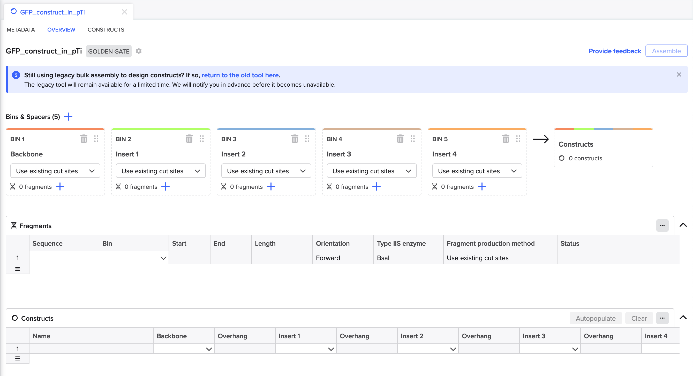

2. Set up your **Assembly Wizard Overview** tab, by renaming the bins for Inserts. Click on the **Insert #** and a text field will open up.
    - **Insert 1** will be `Promoter`, **Insert 2** will be `RBS`, and so on.
     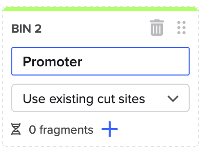

3. Link your destination vector in the **Backbone Bin**.
    - Click on the **+** next to the **0 fragments**, and select **Search for sequences**.
     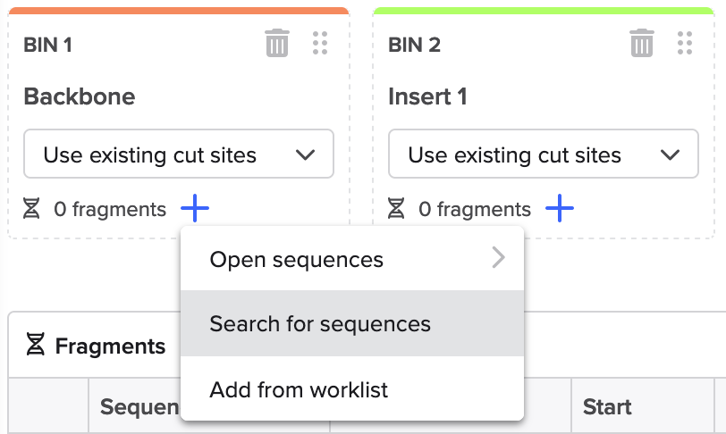
    
    - Use the navigator to find your project folder and select the `destination_pTi_RFP`, this will be the plasmid backbone you assemble into. Then click **Next**.
     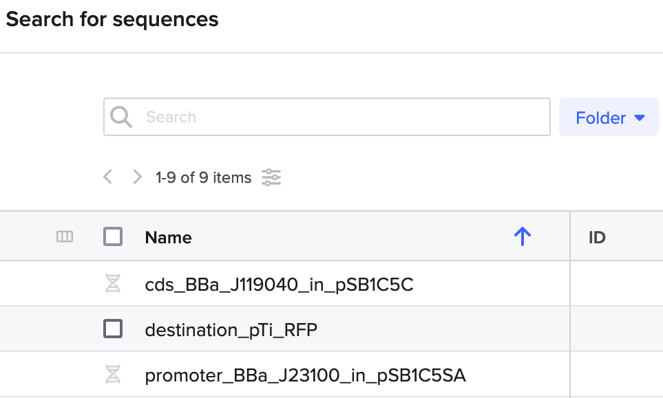

    - You will then be taken to a sequence viewer for destination_pTi_RFP.
     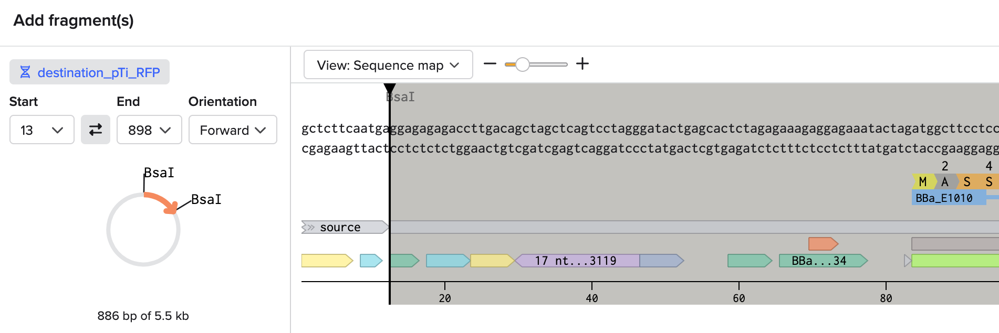
        - _Notice_ that while the **BsaI** restriction sites have been correctly identified, the fragment the **Assembly Wizard** has selected is the RFP insert of the plasmid. This is the selection marker and will be dropped out during assembly. _But_, the RFP insert is **not** the fragment that we want to be carried over into our assembly. Instead, the plasmid backbone (essentially everything else) will be the fragment you want to have selected. 
        - You can correct this by using the switch button  between the start and end fields, and setting the **Orientation** to `Forward`.
         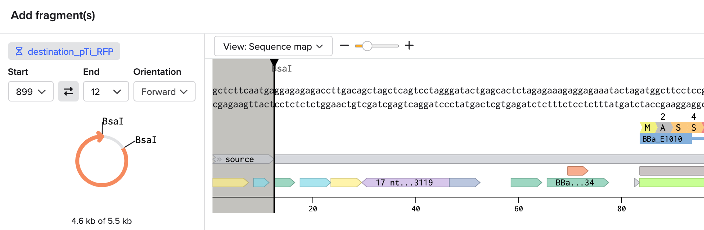
        - Click **Add** to finish adding the fragment to your **Backbone Bin**.
        - You will be returned to the **Assembly Wizard Overview** tab, and you will see that your backbone fragment has been added to the **Backbone Bin** and, in more detail, to the **Fragments** table.
         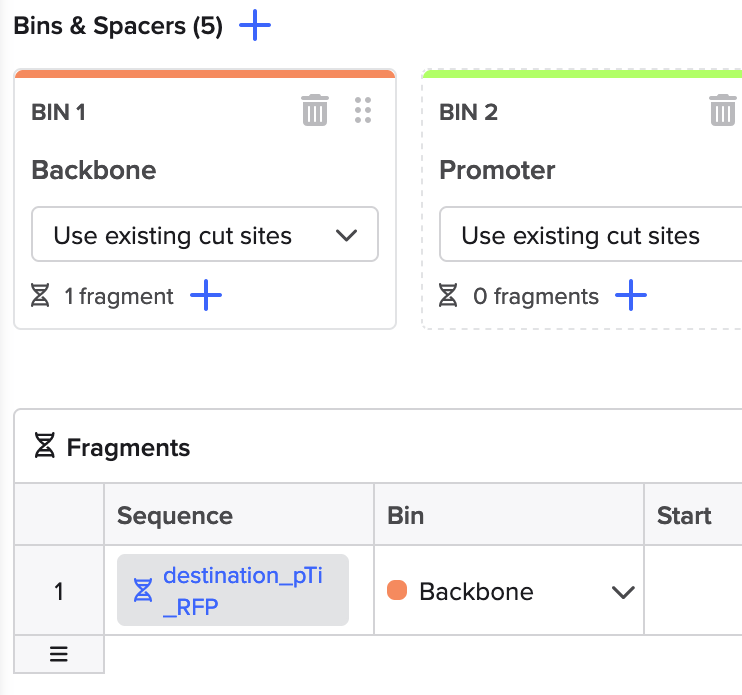
        

4. Link your inserts to their corresponding bins following a similar process as **Step 3**, with the following exceptions: 
    - **For promoters:** When at the navigator step you can select all three promoters that you will be using for your constructs.
     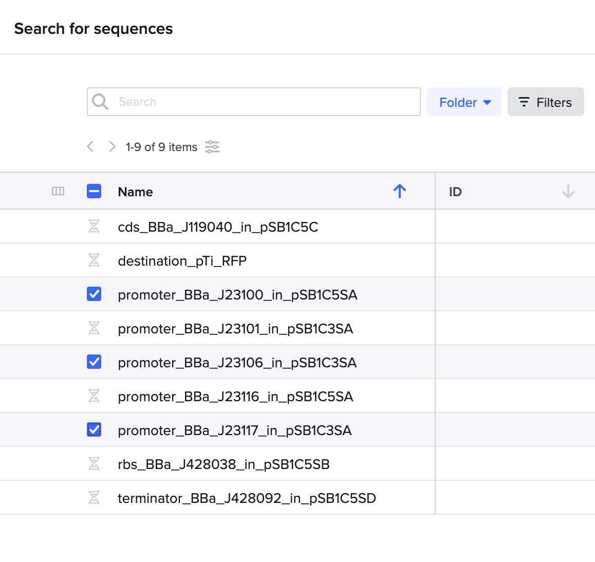
    - **For all inserts:** When at the sequence viewer step for your insert, you should notice that the Assembly Wizard has selected the insert of the plasmid. This *is* the fragment that we want to be carried over into our assembly.
     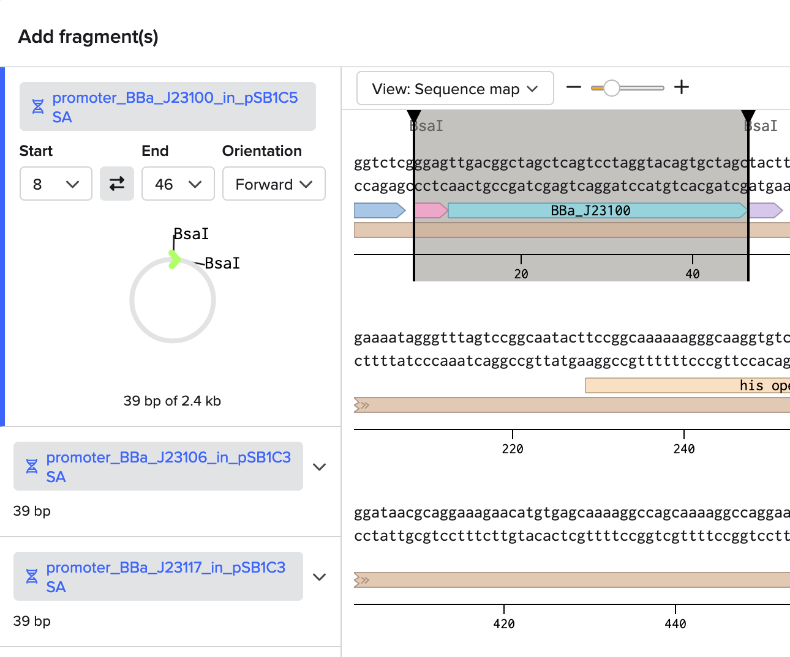

5. After linking all inserts to their respective **Bins**, verify that your **Assembly Wizard Overview** tab has all the required parts and the backbone. It should look like the following:
 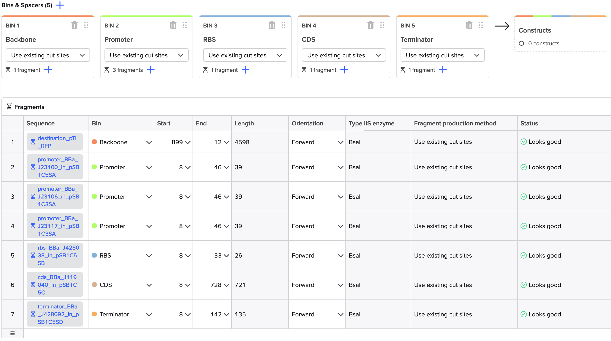

6. Now you can assemble your constructs! In the **Assembly Wizard Overview** tab click the **Autopopulate** button in the **Constructs** table.
 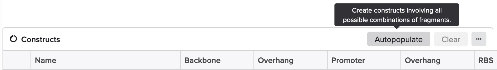
    - If the **Assembly Wizard's** validation process has detected no errors, the **Constructs** table will automatically fill up with your _previews_ of your combinatorial assemblies.
     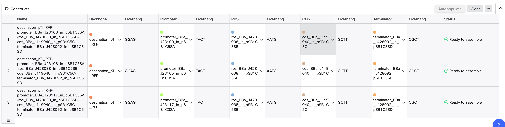
        - Since you have three promoters, you will see three constructs.
        - The parts will be in the correct order: Promoter, RBS, CDS, Terminator
        - The **Overhangs** will match the fusion sites for building a transcription unit in the MoClo / iGEM Type IIS standard.
        - The **Status** will be `Ready to assemble` 
        - _Note_ that the **Name** of these constructs are descriptive, but also quite long. We will want to change that later, as it cannot be changed at this step.
    - At the very top of the **Assembly Wizard**, you can click on the **Constructs** tab to preview your constructs in more detail. This will show you mini-plasmid maps of your constructs, but you can click on one to access the sequence viewer for each construct.
     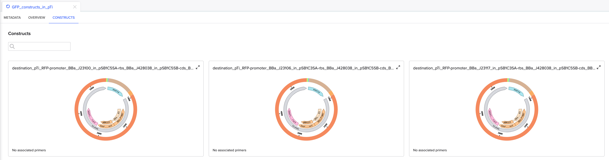
    -  Finally, once you have reviewed your constructs, you can return to the **Overview** tab and click the **Assemble** button in the top right.
     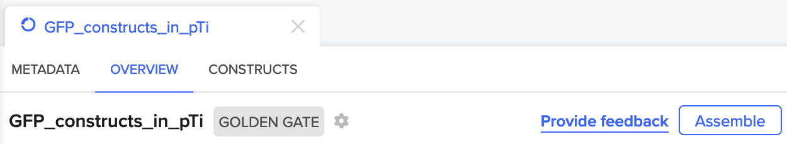
        - A popup box will appear, and there you can choose where to save your assembled constructs
         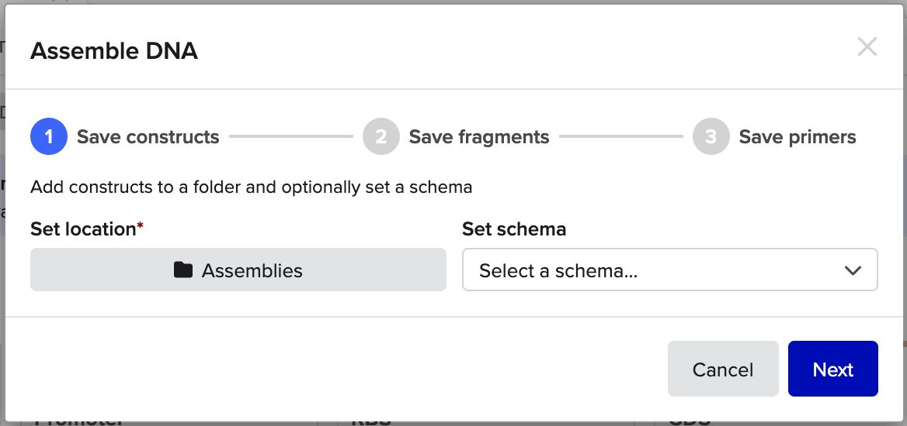
        - Proceed through steps 1, 2, and 3. For the latter two steps, you will have options to save fragments and save primers, for both you can deselect options to save as neither are needed.
        - After step 3, your three assembled constructs will be saved to your `Assemblies` folder, and you will be returned to the Assembly Wizard, but now it will be a static record of your assembly.
          

7. Check your `Assemblies` folder for your constructs. 
    - Use this as an opportunity to rename the constructs to a shorter but identifiable name, we recommend the naming scheme of: `J231XX_GFP_construct_in_pTi`. This will be the naming scheme we continue to use for these constructs throughout the Bootcamp, as it makes it clear a) what the distinguishing part is (promoter), b) what is being expressed (GFP), and c) what plasmid backbone it is in (pTi).
     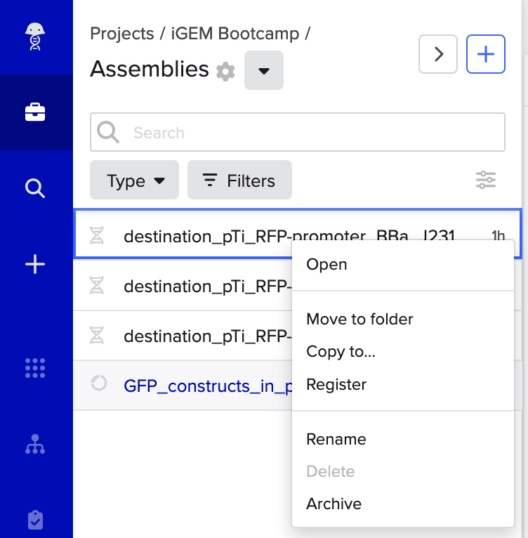 
    - You can also review your saved constructs through the sequence viewer and use the associated tools to ensure that these _in silico_ assemblies are correct. We have also provided complete constructs in GenBank format to validate your constructs against. We will cover this all in the next section **Validate your constructs**
        
    

