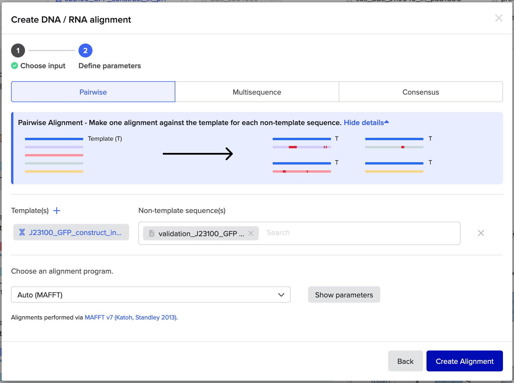
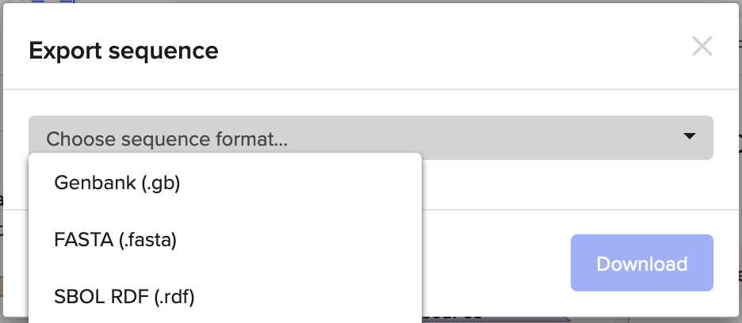

# Benchling Workflow

To follow along with this [Design Module](1_design.md) workflow example, you will need a [Benchling](https://benchling.com/) account. 
You may already have one as part of your academic lab group, but if not you will need to create one. 

For more information specific to Benchling including features that we will discuss here, please look through [Benchling’s documentation](https://help.benchling.com/hc/en-us/categories/6455186023309-Product-Documentation). 
We also recommend exploring and familiarizing yourself with Benchling’s UI before beginning.

## 1. Create project folder
Login into Benchling and create a new project folder for the `iGEM Bootcamp`. 
Create folders within that for `Basic Parts`, `Plasmid Backbone`, `Controls`, and `Assemblies`. 

 

### Resources
- **Benchling Docs:** [Create projects to organize data](https://help.benchling.com/hc/en-us/articles/9684279165069-Create-projects-to-organize-data)

## 2. Import your files
Download and unzip the part and plasmid files on your computer. 
All files you will import will be in the `Part in Backbone` folder.

In Benchling, import the part files into the `Basic Parts` folder, the plasmid backbone file into the `Plasmid Backbone` folder, and the control files into the `Controls` folder. The `Assemblies` folder will be empty for now. 

1. While in your folder `[+]` >> `DNA/RNA sequence` >> `Import DNA / RNA sequences`.
 

2. On the next screen follow the instructions to upload the files. You can do this all at once per a destination folder (Parts, Controls, etc). 
Benchling will load the files in, and let you make adjustments.
    - **Some things to check ...**
        - The **Set folder** is correctly designated to the one within the iGEM Bootcamp project folder
        - For the **Name** of the import, Benchling defaults to the LOCUS name in the GenBank file. This may cause confusion if it is different from the filename. Make sure the import is named exactly as the original filename by clicking on this box when it appears.
         
        - **Topology** is set to `circular`, since these are all complete plasmids (Part in Plasmid Backbone)

3. Press **Close** to complete the upload. Benchling will have uploaded the files in the background, so you only need to close the window. If you want to undo the upload though, while still on this window you can select the trash can icon to delete the uploads.

4. Use the Project navigator to check that all the files are in their respective folders.
    - Basic Parts
    - Plasmid Backbone
    - Controls

### Resources
- **Input File:** [Parts & Plasmids File]()
- **Benchling Docs:** [Importing DNA sequences](https://help.benchling.com/hc/en-us/articles/9684298175245-Importing-DNA-sequences)

## 3. Part verification. 
Now that you have imported all the necessary files, you can use the sequence viewer and associated tools to check them individually. **Note:** do not edit these sequence files while in Benchling. 

Some things to check for ...
- the part (and annotations) match the expect part based on filename
- there are BsaI sites on the plasmid backbone that flank the part of interest. 
- the part is flanked by the correct MoClo/iGEM Type IIS fusion sites based on part type
- there are no restriction enzyme sites within the part or plasmid backbone sequence that may affect assembly. 

### Resources
- **Benchling Docs:** [View DNA sequences](https://help.benchling.com/hc/en-us/articles/9684249350541-View-DNA-sequences-and-change-display-features)
- **Benchling Docs:** [Find restriction enzyme cut sites](https://help.benchling.com/hc/en-us/articles/9684282068877-Find-restriction-enzyme-cut-sites) 

## 4. Assemble _in silico_
With your parts verified, you can now move on to assembling them _in silico_. There are a few ways to do this but we will use the following workflow.

**Note:** During this workflow, you will also see specific basepair locations in the screenshot. Please note that these may be a bit different to the exact numbers you will see, depending on if there were updates to the GenBank files due to corrections or re-indexing. 

While in your folder `[+]` >> `DNA/RNA sequence` >> `Assemble DNA sequences by cloning`. The window below will pop up.

 
1. Prepare the **Assembly settings** as follows:
    - Start by naming your assembly record `GFP_constructs_in_pTi`. This will be the name of the _record_ of the _in silico_ assembly, **not** the name of the assemblies (constructs) that are produced.
    - Choose your `Assemblies` folder as the **Location** to save your assembled constructs and the assembly record
    - Select `5` for **Number of fragment bins** (1 for the plasmid backbone, 4 for the basic parts)
    - Select `Circular` as the **Topology of construct**
    - Select `Golden Gate` as the **Cloning method**, and `BsaI` as the **Type IIS Restriction Enzyme**

 

2. Set up your **Assembly Wizard Overview** tab, by renaming the bins for Inserts. Click on the **Insert #** and a text field will open up.
    - **Insert 1** will be `Promoter`, **Insert 2** will be `RBS`, and so on.
     

3. Link your plasmid backbone in the **Backbone Bin**.
    - Click on the **+** next to the **0 fragments**, and select **Search for sequences**.
     
    
    - Use the navigator to find your project folder and select the `destination_pTi_RFP`, this will be the plasmid backbone you assemble into. Then click **Next**.
     

    - You will then be taken to a sequence viewer for destination_pTi_RFP.
     
        - _Notice_ that while the **BsaI** restriction sites have been correctly identified, the fragment the **Assembly Wizard** has selected is the RFP insert of the plasmid. This is the selection marker and will be dropped out during assembly. _But_, the RFP insert is **not** the fragment that we want to be carried over into our assembly. Instead, the plasmid backbone (essentially everything else) will be the fragment you want to have selected. 
        - You can correct this by using the switch button  between the start and end fields, and setting the **Orientation** to `Forward`.
         
        - Click **Add** to finish adding the fragment to your **Backbone Bin**.
        - You will be returned to the **Assembly Wizard Overview** tab, and you will see that your backbone fragment has been added to the **Backbone Bin** and, in more detail, to the **Fragments** table.
         
        

4. Link your inserts to their corresponding bins following a similar process as **Step 3**, with the following exceptions: 
    - **For promoters:** When at the navigator step you can select all three promoters that you will be using for your constructs.
     
    - **For all inserts:** When at the sequence viewer step for your insert, you should notice that the Assembly Wizard has selected the insert of the plasmid. This *is* the fragment that we want to be carried over into our assembly.
     

5. After linking all inserts to their respective **Bins**, verify that your **Assembly Wizard Overview** tab has all the required parts and the backbone. It should look like the following:
 

6. Now you can assemble your constructs! In the **Assembly Wizard Overview** tab click the **Autopopulate** button in the **Constructs** table.
 
    - If the **Assembly Wizard's** validation process has detected no errors, the **Constructs** table will automatically fill up with your _previews_ of your combinatorial assemblies.
     
        - Since you have three promoters, you will see three constructs.
        - The parts will be in the correct order: Promoter, RBS, CDS, Terminator
        - The **Overhangs** will match the fusion sites for building a transcription unit in the MoClo / iGEM Type IIS standard.
        - The **Status** will be `Ready to assemble` 
        - _Note_ that the **Name** of these constructs are descriptive, but also quite long. We will want to change that later, as it cannot be changed at this step.
    - At the very top of the **Assembly Wizard**, you can click on the **Constructs** tab to preview your constructs in more detail. This will show you mini-plasmid maps of your constructs, but you can click on one to access the sequence viewer for each construct.
     
    -  Finally, once you have reviewed your constructs, you can return to the **Overview** tab and click the **Assemble** button in the top right.
     
        - A popup box will appear, and there you can choose where to save your assembled constructs
         
        - Proceed through steps 1, 2, and 3. For the latter two steps, you will have options to save fragments and save primers, for both you can deselect options to save as neither are needed.
        - After step 3, your three assembled constructs will be saved to your `Assemblies` folder, and you will be returned to the Assembly Wizard, but now it will be a static record of your assembly.
          

7. Check your `Assemblies` folder for your constructs. 
    - Use this as an opportunity to rename the constructs to a shorter but identifiable name, we recommend the naming scheme of: `J231XX_GFP_construct_in_pTi`. This will be the naming scheme we continue to use for these constructs throughout the Bootcamp, as it makes it clear a) what the distinguishing part is (promoter), b) what is being expressed (GFP), and c) what plasmid backbone it is in (pTi).
      
    - You can also review your saved constructs through the sequence viewer and use the associated tools to ensure that these _in silico_ assemblies are correct. We have also provided complete constructs in GenBank format to validate your constructs against. We will cover this all in the next section **Validate your constructs**

### Resources
- **Benchling Docs:** [Running Golden Gate assemblies with the combinatorial assembly tool](https://help.benchling.com/hc/en-us/articles/20473158763533-Running-Golden-Gate-assemblies-with-the-combinatorial-assembly-tool)

    
## 5. Validate your constructs
You will now validate that your _in silico_ assembled constructs are correct. We will do this by using a sequence alignment against constructs from the `Validation` folder from the Parts & Plasmid file. You will follow these steps for each of your constructs.

1. While viewing a construct (Example `J23100_GFP_construct_in_pTi`), use the alignment tool menu in the right hand toolbar.​ Click on **Create Alignment**.
  

2. A window will pop up where you will upload a genbank file(s) to align against the construct you have chosen. Upload the validation file from the `Validation` folder that corresponds to the promoter used in your construct (Example `validation_J23100_GFP_Expression`).
  
    - Once uploaded you will see both sequences in the **Sequences** section. Click **Next**.

3. In the next step, you will finish setting the parameters for the alignment. You can leave this _as-is_, but **note**, there are options here that are useful to consider if you are aligning multiple sequences and/or are unsure of the similarities and differences between sequences.
  
    - When ready, click **Create Alignment**.

4. Benchling will process the alignment and then save it. A pop-up window will appear to open the alignment sequence viewer, but you can also find it saved in the alignment menu for a construct.
 
    - Click the alignment to open the alignment sequence viewer  .

5. In the alignment sequence viewer you can scroll horizontally to both sequences in their entirety. There is also a mini-map at the bottom of the viewer that will show any mismatches as vertical red lines.
  
    - If your _in silico_ assembled construct (Template) is correct, the validation sequence will have 0 **Mismatches** and a 100% **Identity**.

### Resources
- **Benchling Docs:** [Viewing and Managing Alignments](https://help.benchling.com/hc/en-us/articles/9684248594701-Viewing-and-managing-alignments)

## 6. Export your constructs
Once you have validated your constructs, you now have _in silico_ reference sequences of the constructs you will assemble in the Build Module. When you have assembled these constructs and sequenced them, you can then align your sequence data to these _in silico_ assemblies to ensure that your Build constructs are correct or identify issues.

You can export these constructs to use with other software tools or for storing, sharing, and presenting them.

1. While viewing a construct in Benchling, click on the **METADATA** tab. On this tab there will be a `...` button in the top right corner. When clicked, there will be an option to **Export sequence**. 
 

2. A window will pop up to let you select your export's file type and download your construct.
  

### Resources
- **Benchling Docs:** [Export DNA Sequences](https://help.benchling.com/hc/en-us/articles/9684263522189-Export-DNA-Sequences-gb-fasta-csv-svg-rdf-zip)

## 7. Finished!
With this _in silico_ assembly workflow completed, you can now return to finish the [Design Module](1_design.md).