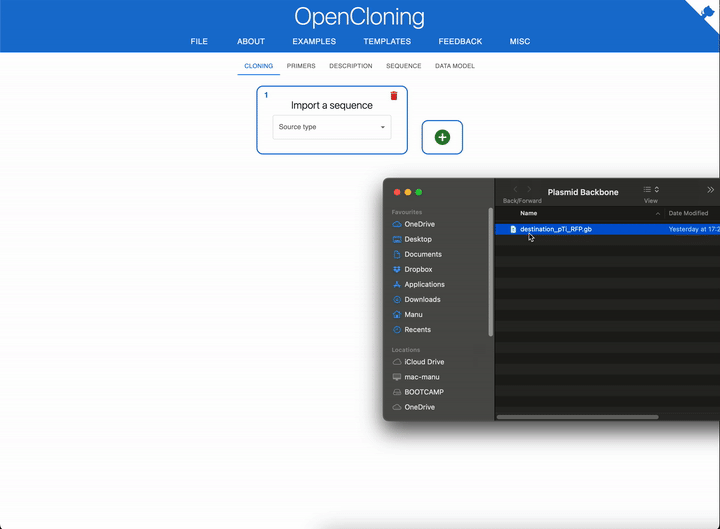
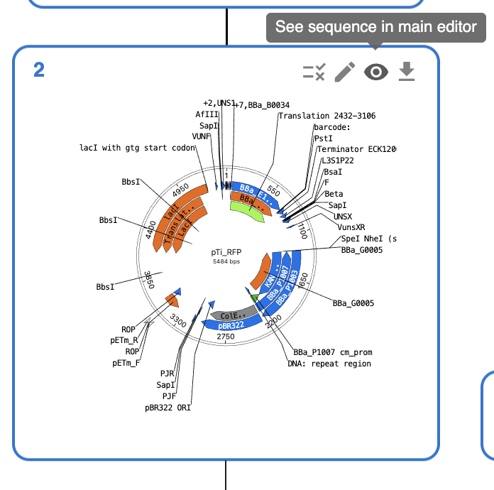
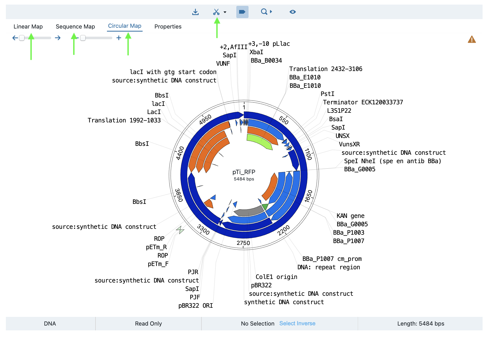
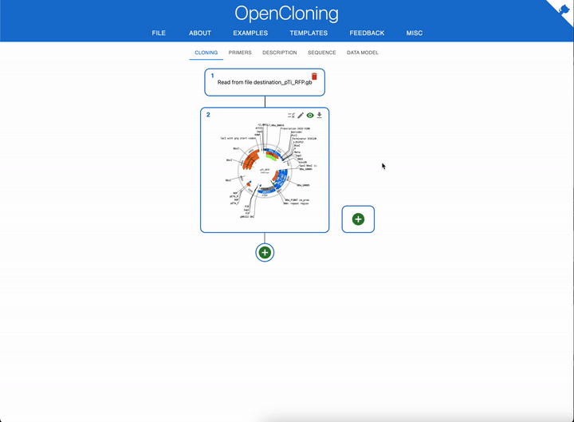
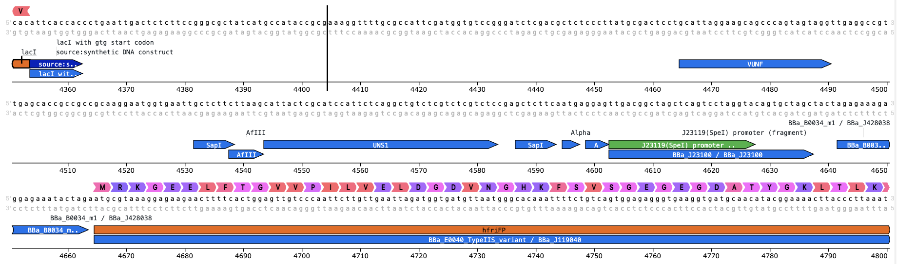
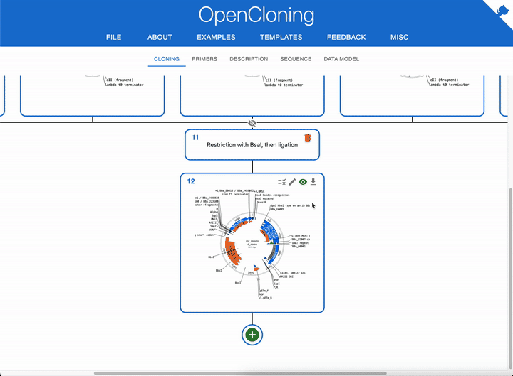
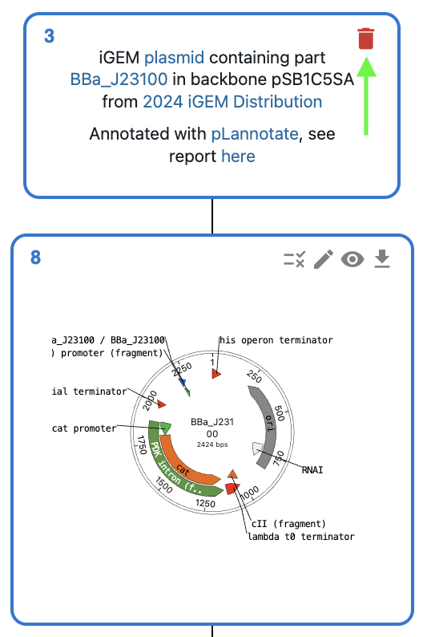

# 🧬 OpenCloning Workflow

To follow along with this [Design Module](1_design.md) workflow example, visit the [OpenCloning website](https://opencloning.org/).

We recommend exploring and familiarizing yourself with OpenCloning's UI before beginning. To do so, you can see their [demo video](https://github.com/manulera/OpenCloning/blob/master/demo_video.md).

## 📥 Import sequence files

In OpenCloning, you can import sequences from files, but also from repositories including the [iGEM Distribution](https://technology.igem.org/distribution/handbook).

### 📂 Loading a sequence from a file and exploring it

Let's start by importing the backbone plasmid sequence from the file `destination_pTi_RFP.gb`. Simply drag and drop the file into the OpenCloning cloning tab:

You can now explore the sequence in the editor, by clicking on the eye icon at the top right of the plasmid map:

In the editor, you can use different types of views to explore the sequence (switch between them using the `Linear Map`, `Sequence Map` and `Circular Map` tabs on top). To customise the display cutsites in the sequence, click on the scissors icon on the top.

### 🌐 Loading sequences from the iGEM Distribution

You can load the rest of the sequences from the files in the repository, as before by dragging and dropping them into the cloning tab. However, if you want to document your workflow indicating that they come from the iGEM distribution, you can also directly load them.

In this example, we are loading the plasmid with the promoter (part `BBA_J23100`), but you would want to load the rest of the parts for the first assembly:

* RBS: `BBA_J428038`
* terminator: `BBA_J428092`
* CDS: `BBA_J119040`

Great! Now you have all the parts for the first assembly.

## 🔬 Design the first assembly

> You can follow along with [this video](./assets/images/workflows/opencloning/oc-assemble-and-download.mp4) (click on the link and select "view raw" to download it)

<video src="https://user-images.githubusercontent.com/126239/151127893-5c98ba8d-c431-4a25-bb1f-e0b33645a2b6.mp4"></video>

To design the first assembly, click on the `+` sign bottom below either of the plasmids:

* This will open a new "source", which represents a manipulation or cloning step.
* In this case, we want to use a Golden Gate assembly, which is ultimately a restriction enzyme cut and ligation reaction. Select `Restriction + ligation / Golden Gate` from the dropdown menu.
* That will let you select first the inputs for the reaction. Since you want to use all the plasmids you imported, click on `Select all`.
* Finally, select the restriction enzymes you want to use for the assembly, in this case `BsaI`.
* Click on `Submit` and you should see two possible outputs for the reaction.
  * The one we want: contains the plasmid backbone with our construct (promoter + RBS + CDS + terminator) replacing the RFP (BBa_E1010).
  * The other one: contains all ligated backbones and the RFP.
* We keep the one with the construct
* You can rename the output plasmids by clicking on the pencil icon on the top right of the plasmid map.
* You are done! You can double-check that things look right by going to the sequence editor and verifying that your construct is there (you can see the parts as features):

### 🔍 Validate your construct

In real-life, once you have built your plasmid, you would want to validate it has the correct sequence. To do so, you would align your _in silico_ generated sequence to the sequencing result.

In this case, we will use the file `genbank_files/part in backbone/Validation/validation_J23100_GFP_Expression.gb` as a validation sequence.

For that, click on the validation icon on the top right of the plasmid map, and upload the validation sequence:

### 📥 Download the design

You can download the design by clicking on the download icon on the top right of the plasmid map (see video above). You can download the design as:
* fasta: contains only the sequence of the plasmid
* genbank: contains the plasmid sequence with all the annotations
* json: contains the full cloning strategy (all plasmids used). You can use to recreate your workflow in the website by dragging and dropping the json file into the cloning tab.
* zip: contains the same as the json file, but also the sequencing data that you added for validation (only available if you added sequencing data).

## 🔄 Design the rest of assemblies

Since you are only changing the promoter, you can simply delete the sequence with the promoter you already used (`J23100`) by clicking on the red trash icon. Then, load the next promoter (`J23101`) as previously, and do the assembly again.

You can repeat this process until you have designed all the assemblies you need.