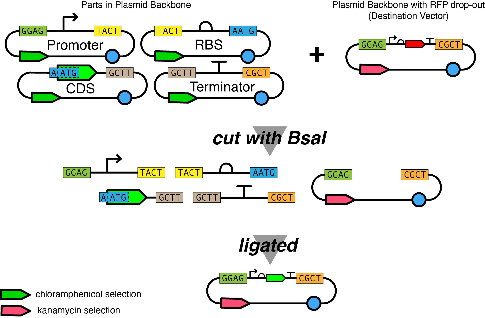

# Build Module
[Introduction](/0_intro/0_intro.md) >> [Design](/1_design/1_design.md) >> [Build](/2_build/2_build.md) >> [Test](/3_test/3_test.md) >> [Learn](/4_learn/4_learn.md)

**The Build Module is currently under development.**

## Overview
This Build Module is a hands-on lab component of the DBTL Bootcamp. 
In this module you will prepare all the required basic parts and the plasmid backbone with drop-out from your [iGEM Distribution Kit](https://technology.igem.org/distribution/introduction) to build the constitutively expressing GFP constructs that you designed and _in silico_ assembled in the Design Module. 

This is all described in the [Introduction](/0_intro/0_intro.md) and in further detail in the [Design Module](/1_design/1_design.md), so please read and understand those sections before starting the Build Module. 

<figure>

</figure>

You will use those basic parts, the plasmid backbone with drop-out, and Golden Gate Assembly (GGA) to create several different constructs with different transcriptional expression levels. Once you have validated that your assembled constructs match your _in silico_ assemblies, you can proceed to the [Test Module](/3_test/3_test.md), where you will characterize them. 

While this module includes a fairly standard workflow to get to this point, it does take 5/6-days with several steps which we have elaborated on in the [Workflow Overview section](#workflow-overview).

> **IMPORTANT:** As with all experimental procedures, preparation is of key importance. 
Before starting in the lab, read through the entire module: familiarize yourself with the protocols, the materials, and the equipment needed.

### Can't Build? Don't worry!

If you are unable to assemble your designed constructs, or have decided not to do the Build Module, you can (mostly) skip this module. 
Instead, you can transform a selection of [Interlab devices](#build-alternative-interlab-devices) directly from the Distribution Kit, and use those in the [Test Module](/3_test/3_test.md). 
_No assembly required!_

### What you will need to know before you start
- **IMPORTANT:** 
Before you start any work in the lab, make sure you have completed ALL of your institution's safety requirements.
- Core concepts & terminology from the [Introduction](/0_intro/0_intro.md) and [Design Module](/1_design/1_design.md).
- Basic laboratory techniques and familiarity with all the equipment that are used in the workflow/protocols below.
- Keeping a good notebook! Make sure to follow best practices and any guidelines from your lab group, but [here](/2_build/tips-notebook.md) are some general tips.

## Resources Needed
The following are the resources needed for the Build Module. 

- Chemically competent _E. coli_ cells, preferably DH5a and DH10b, or strains with recA1 and endA1 mutations
- Miniprep DNA extraction kit to isolate plasmid DNA from transformed cells
- Media: 
    - LB broth
    - SOC broth
    - LB agar plates
    - Kanamycin and chloramphenicol antibiotic stocks
    - 80% sterile glycerol.
- Enzymes, buffers, and other reagents 
    - BsaI and associated buffers
    - T4 DNA Ligase and associated buffers
    - Optional: BSA + PEG-3350
- Equipment: 
    - micropipettes and tips
    - water bath or heat block for transformations
    - Nanodrop, Qubit & reagents, or other device to measure DNA concentration
    - Thermocyler for GGA
- Other materials
    - plate spreaders / glass beads
    - 14-mL cell culture tubes
    - PCR and microcentrifuge tubes
    - ice bucket and ice or cold block
    - iGEM Distribution Kit

>**Note** that this list is not completely exhaustive as there are some things that we assume your lab has access to, from small things (lab pens, glassware) to larger ones (-80°C freezer, centrifuge).
We have also not included quantities, it is important for you to understand the workflow, read through the protocols, and keep track of those yourself. 

## Workflow Overview
The following is a 6-day plan for the Build Module, that will take you from transforming parts from the iGEM Distribution Kit, to assembling your constructs, and finally preparing glycerol stocks for future use. 

You or your lab may have your preferred protocols (and workflow) for all of the steps in this plan, so feel free to use those. 
However, we have also included recommended protocols and tips from iGEM and the iGEM Engineering Committee, which in case of issues, we are more adept at providing troubleshooting help for.

Depending on your level of experience and/or available time, you may be able to combine the Day 4 work (transform assembly reaction) with Day 3, to shorten this workflow to 5 days.

> **IMPORTANT:** All parts from the distribution kit MUST first be transformed into competent cells. 
Once these cells are growing, you can make glycerol stocks and miniprep the plasmids from overnight cultures. 
These miniprepped plasmids are what you will use for the assembly reactions. 
DO NOT use DNA from the distribution kit directly in an assembly reaction.

- **[Day 0](#day-0)** (Before you start)
    - Competent cells
    - Antibiotic stocks and media
- **[Day 1](#day-1)**
    - Transform plasmids from Distribution Kit*
- **[Day 2](#day-2)**
    - Pick colonies and inoculate overnight cultures
- **[Day 3](#day-3)**
    - Make glycerol stocks
    - Make minipreps and quantify DNA
    - Setup Assembly reaction
- **[Day 4](#day-4)**
    - Transform assembly reaction
- **[Day 5](#day-5)**
    - Screen colonies 
    - Select GFP-positive colonies and inoculate overnight cultures
- **[Day 6](#day-6)**
    - Make glycerol stocks
    - Miniprep plasmids
    - Confirm plasmid sequences

> **Note:** This plan does not include time for the following:
> - preparing & testing competent cells
> - sequence confirmation of parts/constructs

## Day 0
Day 0 includes materials and reagents that you will need before you start.
It is quite common to have these already in accesible in the lab, but you should make sure you have enough to complete the Build module.

### Competent cells
There are two general types of [competent _E. coli_ cells](https://en.wikipedia.org/wiki/Transformation_(genetics)#Bacterial): chemically competent and electrocompetent. 
Electrocompetent cells require an electroporator which you may not have access to in your lab. 
So for this bootcamp, we will cover making and using chemically competent cells, since you only need a heated water bath or heat block to transform the plasmids into your cells. 

For chemically competent cells, you can either purchase these cells from a vendor or make them in the lab.
Vendors will often sell a range of competent cells for different purposes and transformation efficiencies. 
These commercial competent cells are validated so it can make troubleshooting easier, but they are an added expense. 

If you are unable to purchase competent cells, we have provided a protocol below so you can make your own cells and test their efficiency. 

#### Protocols
- [Preparing Competent Cells](./protocol-preparing-competent-cells.md)
- [Competent Cell Efficiency](./protocol-competent-cell-efficiency.md)

#### Additional Resources
- [Bacterial Transformation (Addgene)](https://www.addgene.org/protocols/bacterial-transformation/)

### Antibiotic stocks and media
For this bootcamp (the Build and Test modules) you will need chloramphenicol and kanamycin antibiotic stocks.
You will add those to LB liquid media and LB agar.

Most labs typically make stocks of a 1000x concentration of common antibiotics which are filter-sterilized through a 0.22µm syringe filter, aliquoted and stored in the freezer. 

For example, you might make 10mL at stock concentration, run it through a filter with a syringe and divide into 0.5-1 mL aliquots and freeze.
Then when setting up a 4 mL culture for a single plasmid you would use 4 µL of the stock antibiotic in 4 mL of LB media to achieve a working concentration of 1/1000. 

| Antibiotic | Stock conc. (mg/mL) | Working conc.	(µg/mL) | Dilution | Solvent |
| --- | --- | --- | --- | --- |
| Chloramphenicol | 20 | 20 | 1,000× | in EtOH |
| Kanamycin | 50 | 50 | 1,000× | In ddH2O |

Adapted from the Barrick Lab's [Antibiotic concentrations and stock solutions](https://www.barricklab.org/twiki/bin/view/Lab/ProtocolsAntibioticStockSolutions).

## Day 1
### Transform plasmids from Distribution Kit

The following table contains the basic information for the parts and plasmid backbone you will need to transform from the [iGEM Distribution Kit](https://technology.igem.org/distribution/handbook).

<figure>

</figure>

From this list you will do **eight** transformations, as you do _not_ need to transform all five promoters, only the ones you selected for your _in silico_ assemblies in the [Design Module](/1_design/1_design.md).

**Transform**
- 3 Anderson Promoters
- the rbs, cds, and terminator
- the Positive and Negative Controls

| BBa_ name | description | part type | Plasmid Backbone | AbR | Total Plasmid length (bp) |
| --- | --- | --- | --- | --- | --- |
| BBa_I20270 | Positive control | device | pSB1C3 | CmR | 5337 |
| BBa_J23100 | Anderson promoter | promoter | pSB1C5SA | CmR | 2424 |
| BBa_J23101 | Anderson promoter | promoter | pSB1C3SA | CmR | 2467 |
| BBa_J23106 | Anderson promoter | promoter | pSB1C3SA | CmR | 2467 |
| BBa_J23116 | Anderson promoter | promoter | pSB1C5SA | CmR | 2424 |
| BBa_J23117 | Anderson promoter | promoter | pSB1C3SA | CmR | 2467 |
| BBa_J428038 | BBa_B0034 Type IIS variant | rbs | pSB1C5SB | CmR | 2411 |
| BBa_J119040 | BBa_E0040 Type IIS variant | cds | pSB1C5C | CmR | 2766 |
| BBa_J428092 | BBa_B0015 Type IIS variant | terminator | pSB1C5SD | CmR | 2520 |
| BBa_J434151 | pTi plasmid backbone with RFP drop-out (and negative control) | plasmid backbone | BBa_J434150 | KanR | 5484 |

_KanR = kanamycin resistant, CmR = chloramphenicol resistant_

These are all available in the following iGEM Distributions, and we have included their locations as separate csv files:
- [2024 Distribution Locations](./assets/platemaps/2024-distribution-bootcamp-parts.csv)
- 2025 Distribution (TBD)

**Key things to know:** 
- which three promoters did you select for your _in silico_ assemblies?
- the antibiotic resistances of the plasmid backbones, as these are the antiobiotic stocks you need: kanamycin and chloramphenicol
- the sizes in bp of the plasmids, as we will use this to calculate the molar concentration for the [assembly reaction](#set-up-assembly-reaction).
- there is an estimated 1-2 ng of DNA in each distribution kit well, so if you are using our recommended protocol, assume that you are transforming with 100-200 pg/µL. 

Lastly, you may have noticed that there is a positive control in the table.
That device, BBa_I20270 in pSB1C3, has been used as a positive control for past Interlabs.
We will not be using this as a control for transformations or assembly, but as a control for the [Test Module](/3_test/3_test.md) experiment. 
We will transform it now, so you will not need to do that later.

You may also have noticed that there is not a negative control listed.
That's because we will use the pTi plasmid backbone with RFP drop-out as our negative control in the Test Module.

#### Protocols
- [Distribution Kit Transformations](./protocol-distribution-transformation.md)

#### Additional Resources
- [Bacterial Transformation (Addgene)](https://www.addgene.org/protocols/bacterial-transformation/)

## Day 2
### Pick colonies and inoculate overnight cultures
If your transformations were successful, you will have colonies to pick from!

**Note:** With the exception of the pTi plasmid backbone with drop-out (RFP) and the BBa_I20270 positive control (GFP), none of your transformations should have fluorescent colonies.

Beforehand, set up the culture tubes with LB media with the appropriate antibiotic. We recommend the following:
- Grow two colonies in separate tubes for each transformed plasmid in case of a problem with the overnight culture or low yield.
- If possible, use 14 mL snap cap tubes or cover the tubes with sterile aluminum foil, rather than screw cap tubes, as _E. coli_ will grow better if there is air exchange when growing in a shaking incubator.
- Pre-label all your tubes, with the part/plasmid and the antibiotic
- Each tube should have 4 mL of LB media + antibiotics (see table below).

 

| Antibiotic | # of Plasmids | # of Tubes (2x per plasmid) | LB Media needed |
| --- | --- | --- | --- |
| Chloramphenicol | 7 | 14 | 56 mL |
| Kanamycin | 1 | 2 | 8 mL |

 

For the inoculations:
- Pick a single colony with a sterile toothpick or pipette tip, drop it into the appropriately labeled tube, and cover.
- Incubate your inoculated cultures at 37°C for 16-18 hours in a shaking incubator (200-250 rpm,reciprocal shaking). Do not grow more than 18 hours as this may reduce yields when extracting DNA.

The following day (after 16-18 hours), the cultures should be cloudy.
Measuring the OD600 of your culture is always good practice, and will also help troubleshoot if you have issues with minipreps and glycerol stocks.

#### Additional Resources
- [Inoculating a Liquid Bacterial Culture (Addgene)](https://www.addgene.org/protocols/inoculate-bacterial-culture/)

## Day 3
### Make glycerol stocks
You will need to make glycerol stocks of your transformed _E. coli_ with plasmids for long-term storage.
This allows you to save a sample in your -80°C freezer. You can revive the cells by growing them up on agar plates to pick fresh colonies whenever you need to get more plasmid DNA. 

When using your glycerol stock keep it on dry ice. 
Do not let it unthaw. 
Too many freeze and thaw cycles will degrade its usability and may introduce more mutations.

#### Protocols
- [Glycerol Stock Protocol](./protocol-glycerol-stock.md)

#### Additional Resources
- [Creating Bacterial Glycerol Stocks (Addgene)](https://www.addgene.org/protocols/create-glycerol-stock/)

### Make minipreps
Plasmid DNA can be extracted from _E. coli_ cells at different scales. 
For this procedure you will use the **miniprep** scale as this provides enough DNA for characterization and use in a number of GGA reactions. 

You will use silica columns to bind the plasmid DNA from the lysed and neutralized extract. 
All modern plasmid extraction methods/kits use a three step procedure for creating the neutralized lysate that will be added to the silica containing spin column. 
We have some tips on this process, but you should adhere to the protocols of the kit that you are using.

Plasmid DNA can then be stored long term at -20°C. 

> **Important:** Due to time (and resource cost) we have not included a step here for sequence confirming these transformants. 
This is always good practice though: mistakes and mutations happen!

**Examples of miniprep kits:**
- Qiagen Spin Miniprep Kit
- Zyppy Plasmid Miniprep Kit
- Macherey-Nagel NucleoSpin Miniprep Kit
- Monarch Plasmid Miniprep Kit
- [Coleman Lab protocol](https://coleman-lab.org/lab-protocols/#labprotocols) ([make your own](https://coleman-lab.org/wp-content/uploads/2021/07/plasmid-miniprep-5-ml-spin-column-.pdf))

#### Protocols
- [Miniprep Tips](./tips-miniprep.md)

### Quantify Plasmid preps
In order to perform an assembly reaction you must know the exact molar concentration of your parts in plasmid and the plasmid backbone with dropout. 
You want to have equal-molar amounts of all parts in plasmid as an imbalance can reduce the yield of correctly assembled colonies upon transformation.

UV absorbance is one of the most common ways to quantify DNA. 
Fluorometry is more sensitive, allowing measurement of nanogram quantities of DNA. 
You want to have the quantity of your plasmids expressed in ng/µL.

Follow the instructions for the instrument you will use to quantify your plasmid DNA

**Example instruments:**
- Nanodrop
- UV/Visible spectrophotometer with UV-transparent quartz cuvettes.
- Fluorimetry (Qubit, DeNovix, etc.)

#### Additional Resources
- [DNA Quantification & Spectrophotometer Tips (Addgene)](https://www.addgene.org/protocols/dna-quantification/)

### Set up assembly reaction
Before you start your assembly make sure that you have all of your plasmids prepared and the DNA quantified using the methods listed above.

As mentioned you want to have equal-molar amounts of all parts in plasmid in an assembly reaction. You can use the following equation or an [online calculator](https://nebiocalculator.neb.com/#!/dsdnaamt) to calculate this. 

> moles dsDNA (mol) = mass of dsDNA (g)/((length of dsDNA (bp) x 615.96 g/mol/bp) + 36.04 g/mol)

You will need to know the length of the dsDNA (bp), which we have included in the Distribution table from [Day 1](#day-1). 
Note, this is the total plasmid size (bp) not just the size of the part by itself.

You should start by making 50nM stock solutions of your parts and plasmids.

For the assembly reactions, we recommend using 25 fmol for each part in plasmid, and half as much (12.5 fmol) for the plasmid backbone with drop-out, to reduce religation.

#### Protocols
- [Golden Gate Assembly (Bennett Lab)](https://wiki.rice.edu/confluence/display/BIODESIGN/Golden+Gate+Assembly)

## Day 4
### Transform assembly reaction
Once you have your assembly reactions, you can transform them into your competent cells.
The protocol we recommend below has some key differences compared to the [distribution kit transformations protocol](./protocol-distribution-transformation.md).

#### Protocols
- [Assembly Reaction Transformations](./protocol-assembly-transformation.md)

## Day 5
### Screen colonies and inoculate overnight cultures
On your transformation plates you should see a mixture of GFP and RFP positive colonies. 

The RFP-expressing cells contain the unaltered plasmid backbone with drop-out whereas the GFP-expressing cells contain candidates of your assembled constructs.

[Content needed: UV lightbox & promoter strength for weakly green colonies]

At this stage you will pick (with sterile toothpicks or pipette tips) well isolated individual GFP colonies from the plate and grow them overnight (16-18 hours max) in LB broth with kanamycin. 
Picking four colonies for each assembly is sufficient. 

These overnight cultures will be used on Day 6, to perform miniprep plasmid DNA extractions and make glycerol stocks. 

## Day 6
### Make glycerol stocks and miniprep your constructs
Read through the documentation from Day 3 if you need to!

### Confirm plasmid sequences
Mutations and mistakes happen!
For your own project, you should always confirm the sequence of your constructs so you know that no mutations/errors/mistakes have arisen.

Sequencing will usually involve: 
1. miniprepping your construct plasmids
2. following the submission procedures for your institution/sequencing vendor
    - you may be choosing between NGS whole plasmid or Sanger sequencing
3. receiving data back and using a sequence alignment tool

If possible, we encourage you to use sequencing to confirm the constructs you have assembled for this bootcamp.
For sequence alignment, you will use the [GenBank files](/genbank_files/part%20in%20backbone/Validation/) for your _in silico_ assemblies.

However plasmid sequencing can be expensive, so you may want to restriction map your individual clones beforehand and select one or two clones for sequencing. 

## Build Alternative: Interlab Devices

### ALT Workflow Overview
- **Day 1**
    - Transform plasmids from Distribution Kit
- **Day 2**
    - Pick colonies
- **Day 3**
    - Make glycerol stocks
    - Miniprep plasmids
    - Confirm plasmid sequences

### ALT Day 1
#### Transform plasmids from Distribution Kit

The following table contains the basic information for the Interlab Devices you will need to transform from the [2024 iGEM Distribution Kit](https://technology.igem.org/distribution/handbook).

For this Bootcamp we specifically selected parts (or variants of parts) that were used in these Interlab devices.
They will all use the same Anderson promoter set that you selected from in the Design Module, so you can choose the Interlab Devices you would like to transform based on your promoter choice.

However, these constructs will differ from the ones you _in silico_ assembled in the Design Module, as they were assembled with BioBrick assembly into the pSB1C3 plasmid backbone.

From this you will do **five** transformations, as you do _not_ need to transform all five promoters, only the ones you selected for your _in silico_ assemblies in the [Design Module](/1_design/1_design.md).
- Transform 3 Interlab Test Devices
- Transform the Positive and Negative Controls

| BBa_ name | Promoter | description | part type | Plasmid Backbone | AbR |
| --- | --- | --- | --- | --- | --- |
| BBa_I20270 | BBa_J23151 | Interlab 2018 Positive Control | device | pSB1C3 | CmR |
| BBa_J364000 | BBa_J23101 | Interlab 2018 Test Device 1 | device | pSB1C3 | CmR | 
| BBa_J364001 | BBa_J23106 | Interlab 2018 Test Device 2 | device | pSB1C3 | CmR | 
| BBa_J364002 | BBa_J23117 | Interlab 2018 Test Device 3 | device | pSB1C3 | CmR | 
| BBa_J364007 | BBa_J23100 | Interlab 2018 Test Device 4 | device | pSB1C3 | CmR | 
| BBa_J364008 | BBa_J23104* | Interlab 2018 Test Device 5 | device | pSB1C3 | CmR | 
| BBa_J364009 | BBa_J23116 | Interlab 2018 Test Device 6 | device | pSB1C3 | CmR | 
| BBa_J428100 | BBa_J23101 | Interlab_NegC (luxR) | device | pSB1C3 | CmR |

These are all available in the following iGEM Distributions, and we have included their locations as separate csv files:
- [2024 Distribution Interlab Locations](./assets/platemaps/2024-distribution-bootcamp-interlab-devices.csv)
- 2025 Distribution (TBD)

_CmR = chloramphenicol resistant_

**Key things to know:** 
- the antibiotic resistances of the plasmid backbones, as these are the antiobiotic stocks you need: chloramphenicol
- there is an estimated 1-2 ng of DNA in each distribution kit well, so if you are using our recommended protocol, assume that you are transforming with 100-200 pg/µL. 

Lastly, you may have noticed that there are positive and negative controls in the table.
These devices, BBa_I20270 and BBa_J428100, have been used as controls in past Interlabs.
We will not be using them as a controls for transformations or assembly, but as a control for the [Test Module](/3_test/3_test.md) experiment, so we will transform them now, so you will not need to do that later.

##### Protocols
- [Distribution Kit Transformations](./protocol-distribution-transformation.md)

##### Additional Resources
- [Bacterial Transformation (Addgene)](https://www.addgene.org/protocols/bacterial-transformation/)

### ALT Day 2 & 3
For the following protocols, please refer to the [Day 2](#day-2) and [Day 3](#day-3) of the normal workflow, adjusting for differences in the transformations (count, antibiotic, etc.).

## Test Module
Once you have followed a workflow and produced and validated your assembled constructs, you are ready to proceed on to the [Test Module](/3_test/3_test.md). 

In the Test Module, you will use the GFP constructs to measure fluorescence using a standard protocol, calibrants, and a plate reader. 

This module will also introduce good measurement practices, experimental design principles, and key questions to consider before proceeding to the Test stage of your project.
