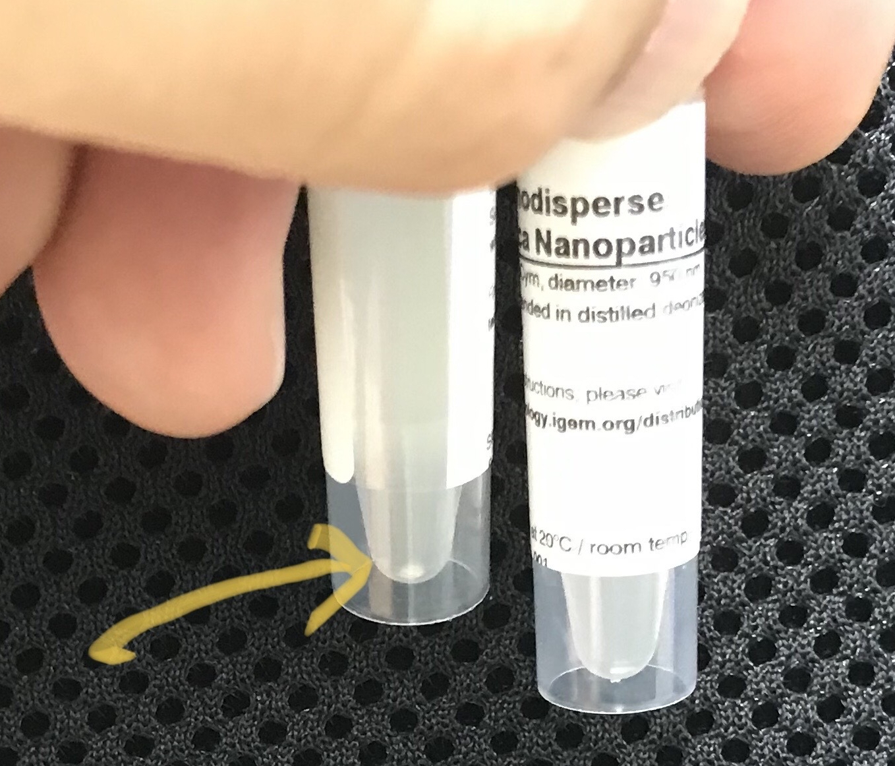
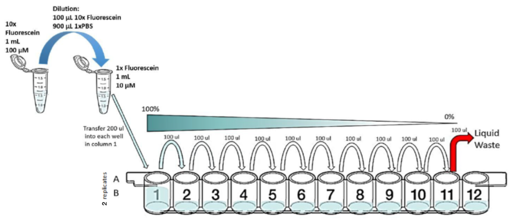
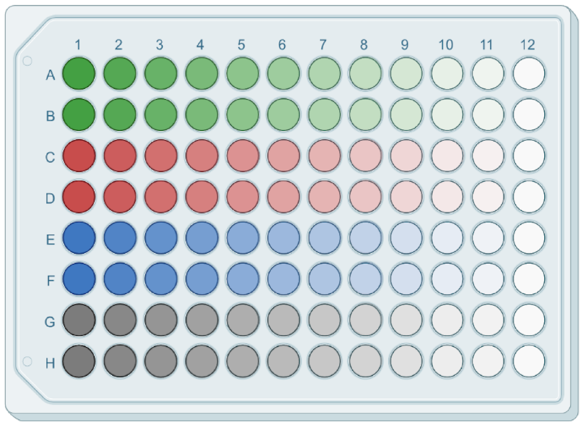

# iGEM Multicolor Fluorescence Calibration protocol

## Overview
Plate readers report fluorescence values in arbitrary units that vary widely from instrument to instrument. 
Therefore, absolute fluorescence values cannot be directly compared from one instrument to another. 
In order to compare fluorescence output of biological devices, it is necessary to create a standard fluorescence curve. 
This variant of the protocol uses two replicates of three colors of dye, plus beads. Adapted from:
- https://dx.doi.org/10.17504/protocols.io.bht7j6rn
- https://dx.doi.org/10.17504/protocols.io.6zrhf56.

Before any experiment, you will need to perform this three-color calibration protocol. 
This protocol only needs to be completed once. 
It entails making stocks and working solutions, making and measuring serial dilutions of each of the three calibrant dyes and the particle calibrant.

**Important:** For the calibration and your experiments, you must use the same type of plates and the same volumes. 
You must also use the same settings (e.g., filters or excitation and emission wavelengths) for the calibration and for the experiment. 
If you do not use the same plates, volumes, and settings, the measurements cannot be calibrated properly.

## Protocol in short
You will use the three color calibrants and the silica nanoparticles to perform serial dilutions from a known initial concentration. 
First, you will put 200uL of each solution in the first column of the plate, and then you will aspirate 100uL and drop them into the corresponding well of the next column. 
After that you will mix each well by pipetting up and down three times, and then you will transfer again 100uL into the well in the next column. 
Repeating this until the 11th column and discarding those last 100uL. 
Finally, you will fill all the wells to a total volume of 200uL with either water of PBS when appropriate. 
This step ensures that we have the same volume in the wells for calibration and for your experiments.

## Protocol Materials
### Fluorescence Measurement Calibrants Kit
- Fluorescein (0.1 umoles dried down)
- Cascade Blue (0.1 umoles dried down)
- Sulforhodamine 101* (0.02 umoles dried down)
- NanoCym 950nm monodisperse silica nanoparticles (3e9 beads/mL)

*Sulforhodamine 101 may be mislabelled as Texas Red in your kit

### Materials provided by the you
- Water, sterile-filtered, BioReagent, suitable for cell culture
- Phosphate Buffered Saline (PBS) 1X (pH 7.4)
- 96 well plate black with transparent flat bottom
- Foil-covered or amber tubes.
- Pipette for 200uL, (single and/or 8-channel)
- Plate reader able to measure absorbance at 600nm and fluorescence either with filters or monochromator.

## Protocol Steps
### Making the stock and working solutions
**Important:** Resuspend all the fluorescent calibrants in amber or foil-covered tubes and do not leave them out in the light for too long, as they are light sensitive.

#### Fluorescein
1. Get the stock reagent tube with Fluorescein calibrant from the Measurement Kit. 
This is a powder. 
Spin down to make sure the pellet is at the bottom.

2. Transfer 1.0mL of Phosphate Buffered Saline (PBS) to stock reagent tube Fluorescein calibrant. 
Resuspend pipetting up and down a few times, and vortex 30 seconds. 
This is now the reconstituted Stock Fluorescein Solution 10X with a concentration of 100 uM in PBS.

3. Obtain a tube to make the working concentration solution 1X Fluorescein.

4. Dilute the Stock Fluorescein Solution 10X with 1X PBS to make a 1X reference working solution with a concentration of 10 uM. E.g. dilute 100 uL of 10X fluorescein stock into 900 uL 1X PBS.

#### Sulforhodamine 101 
5. Get the stock reagent tube containing Sulforhodamine 101 calibrant from the Measurement Kit. 
This is a powder. 
Spin down to make sure the pellet is at the bottom.

6. Transfer 1.0mL of PBS to stock reagent tube Sulforhodamine 101 calibrant. 
Resuspend pipetting up and down a few times, and vortex 30 seconds. 
The reconstituted Stock Sulforhodamine 101 Solution has a final concentration of 20 uM in PBS.

7. Obtain a tube to make the working concentration solution 1X Sulforhodamine 101.

8. Dilute the Stock Sulforhodamine 101 Solution 10X with 1X PBS to make a 1X reference working solution with a concentration of 2 uM. E.g. dilute 100 uL of 10X Sulforhodamine 101 stock into 900 uL 1X PBS.

#### Cascade Blue 
9. Get the stock reagent tube containing Cascade blue calibrant from the Measurement Kit. 
This is a powder. 
Spin down to make sure the pellet is at the bottom.

10. Transfer 1.0mL of Water to stock reagent tube Cascade Blue calibrant. 
Resuspend pipetting up and down a few times, and vortex 30 seconds. 
The reconstituted Stock Cascade Blue Solution 10X has a final concentration of 100 uM in Water.

11. Obtain a tube to make the working concentration solution 1X Cascade Blue.

12. Dilute the Stock Cascade blue Solution 10X with Water to make a 1X reference working solution with a concentration of 10 uM. E.g. dilute 100 uL of 10X Cascade blue stock into 900 uL water.

#### NanoCym 950nm monodisperse silica nanoparticles
13. Get the stock reagent container containing NanoCym 950nm microspheres

14. This tube contains 850uL of NanoCym 950nm monodisperse silica nanoparticles with a concentration of 3e9 microspheres/mL in Water.

15. Vortex NanoCym 950 nm microspheres for 30 seconds. 
Check that the solution is homogeneous, and that there is no visible aggregation of the microspheres (see picture). 
They are now ready to be used. 

**Important:** if vortexing does not produce a homogeneous solution, we recommend using sonication. 

<figure>

<figcaption>
Pictured: An aggregation of microspheres at the bottom of the tube. Vortex this tube. If the aggregate persists after vortexing then sonicate. 
</figcaption>
</figure>

## Calibration Protocol 
### Serial Dilution
16. Prepare a 96 well microplate and label it as Calibration Plate

17. Transfer 100.0uL of PBS to wells A2:D12 of calibration plate. 
Column 12 has the blanks.

18. Transfer 100.0uL of Water to wells E2:H12 of calibration plate. 
Column 12 has the blanks.

19. Transfer 200.0uL of Fluorescein 1X solution to wells A1 and B1 of calibration plate.

20. Transfer 200.0uL of Sulforhodamine 101 1X solution to wells C1 and D1 of calibration plate.

21. Transfer 200.0uL of Cascade blue 1X solution to wells E1 and F1 of calibration plate.

22. Transfer 200.0uL of NanoCym 950nm monodisperse silica nanoparticles to wells G1 and H1 of calibration plate.

23. Perform a series of 10 2-fold dilutions from the first column of calibration plate (this should have already Fluorescein in wells A1 and B1, Sulforhodamine 101 in wells C1 and D1, Cascade Blue in the wells E1 and F1, NanoCym 950nm monodisperse silica nanoparticles in the wells G1 and H1), using PBS or Water (already prefilled) as diluent to a final volume of 200.0uL in wells A1:G:11 of calibration plate. 
For each of the ten steps transfer 100uL from the initial column into the next one and pipette up and down 3X to ensure the dilution is mixed homogeneously before the next transfer. 
This can be performed with a 8-channel pipette easily or with a single channel pipette.

<figure>

<figcaption>
Pictured: Serial dilution of fluorescein in 96well plate. 
</figcaption>
</figure>

24. Discard 100.0uL from wells A11:H11 of calibration plate. 
This step ensures that all wells contain the same volume (100uL). 

25. Transfer 100.0uL of PBS to wells A1:D12 of calibration plate. 
This will bring all wells to volume 200uL. Pipette up and down 3X to ensure the dilution is mixed homogeneously

26. Transfer 100.0uL of Water to wells E1:H12 of calibration plate. 
This will bring all wells to volume 200uL. Pipette up and down 3X to ensure the dilution is mixed homogeneously

The Calibration Plate should look like this:

<figure>

<figcaption>
Pictured: Final plate, with serial dilutions of all three color calibrants and the silica nanoparticles. Each well holds 200uL. Column 12 is entirely blanks (A12:D12 PBS and E12:H12 Water).
</figcaption>
</figure>

### Measurement
28. Measure Fluorescein (green) fluorescence of calibration plate (wells A1:B12) with excitation wavelength of 488.0nm and emission filter of 530.0nm and 30.0nm bandpass.

29. Measure Sulforhodamine 101 (red) fluorescence of calibration plate (wells C1:C12 and D1:D12) with excitation wavelength of 561.0nm and emission filter of 610.0nm and 20.0nm bandpass.

30. Measure Cascade blue (blue) fluorescence of calibration plate (wells E1:E12 and F1:F12) with excitation wavelength of 405.0nm and emission filter of 450.0nm and 50.0nm bandpass.

31. Measure NanoCym 950nm monodisperse silica nanoparticles absorbance of calibration plate (wells G1:G12 and H1:H12) at 600.0nm.

32. Import data for fluorescein fluorescence, sulforhodamine 101 fluorescence, cascade blue fluorescence, and absorbance measurements into the [provided Excel file]().

**Note:** If your equipment does not have the exact wavelengths of bandpass wavelengths, choose the nearest one and take note.

Protocol version: 4.0