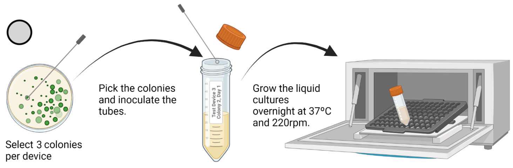
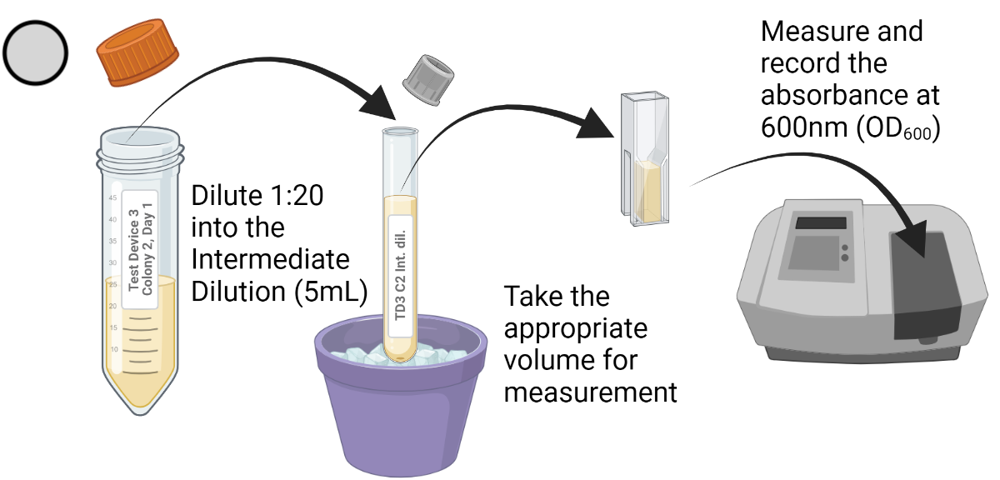
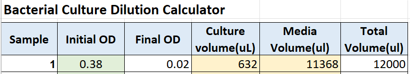
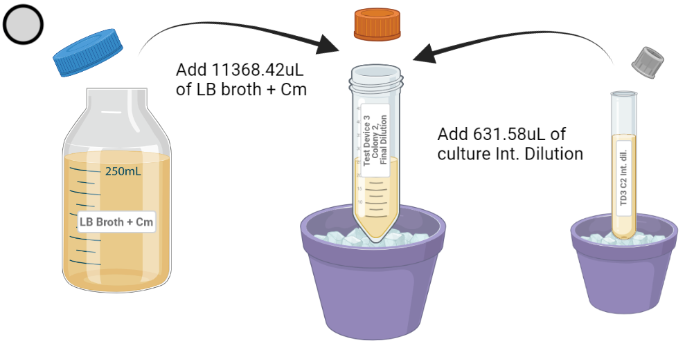
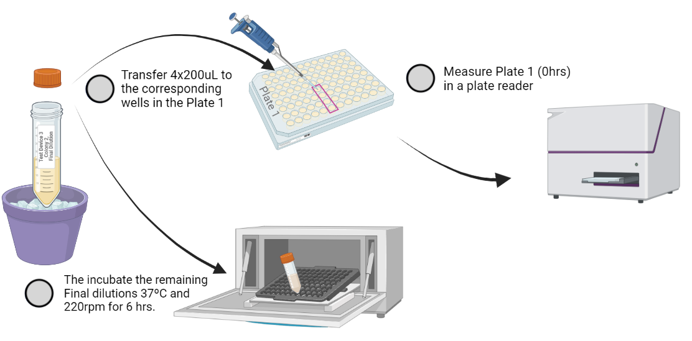
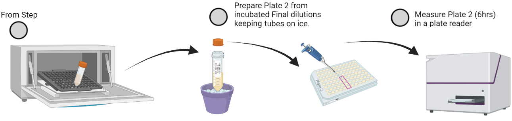

# iGEM Bootcamp Fluorescence Measurement protocol

## Overview
In this protocol we will use a plate-reader to measure the OD600 and GFP fluorescence of our constructs in cells.

Before performing this experiment, ensure that you have completed the calibration measurements. 
Do not proceed without completing the [calibration protocol](/protocol-calibration-fluorescein.md). 

**Important:** For both the calibration and the experiment, use the same type of plates, the same volumes, and the same instrument settings (e.g., filters or excitation and emission wavelengths). Failing to do so will result in improper calibration of your measurements.

## Protocol in short

You will streak out five constructs from glycerol stocks: three designed and assembled by you, along with positive and negative controls. 
The following day, pick three colonies from each plate (construct) and inoculate them into 12mL of media in tubes, for a total of 15 cultures.

Each of these 15 overnight cultures will be diluted to a known OD600 and aliquoted into a 96-well plate (200 µL per well, 4 technical replicates) for the 0hr timepoint. 
The remaining diluted culture will be grown for 6 hours and then aliquoted into a second 96-well plate (200 µL per well, 4 technical replicates) for the 6hr timepoint. 
After each plating, you will use a plate reader to measure fluorescence and absorbance at both the 0hr and 6hr timepoints.

## Protocol Materials

- Constructs
- LB Broth + Kanamycin (50 ug/mL)
- LB Agar + Kanamycin (50 ug/mL)
- Kanamycin stock solution (50 mg/mL)*
- Ice
- Shaking incubator (normal for culture tubes)
- Petri dish (x 5)
- 14mL culture tube (x10)
- 50mL conical tube (x20)
- 2x 96 well plate black with transparent flat bottom
- Pipette for 200uL, (single and/or 8-channel)
- Plate reader able to measure absorbance at 600nm and fluorescence either with filters or monochromator.

## Day 0

1. Prepare 5 Petri dishes with LB Agar + Kanamycin (Kan) growth medium. 
Label petri dishes with the following convention: Construct Name, Day 0.

2. Streak out constructs from glycerol stocks onto their corresponding labeled petri dishes.

3. Incubate overnight (for at least 16 hours) at 37°C.

## Day 1
4. Prepare 15 culture tubes (50mL) with 12mL of LB Broth + Kan.
Label each tube using the following convention: Construct Name, Colony #, Day 1.
You will pick three colonies per construct (5 constructs x 3 colonies = 15 tubes).

5. Inoculate each tube by picking a single colony from the corresponding Petri dish.

6. Incubate all 15 culture tubes overnight for 16 hours at 37°C and 220 rpm in a shaker incubator.

<figure>

<figcaption> 
</figcaption>
</figure>

## Day 2

### Preparation of the Intermediate dilution and OD measurement
To begin the experiment with a known cell density (OD600), you will first perform intermediate dilutions of the overnight cultures.

7. Prepare 15 new culture tubes (14mL) for the intermediate dilutions.
Label these new tubes with a similar convention as Step 4, as follows: i.e., Construct Name, Colony 2, Day 2, Intermediate Dilution.

8. Dilute each of 15 culture samples at a 1:20 ratio into LB Broth + Kan. 
To make a 1:20 dilution, combine 4750uL of LB Broth + Kan with 250uL of the Day 1 culture into the Intermediate Dilution tubes (5ml total). 
Maintain the tubes at 4°C or on ice while performing dilutions.

9. Measure the OD600 of each intermediate dilution using a spectrophotometer.
Take the appropriate volume from the Intermediate Dilutions and read the absorbance at 600nm in a spectrophotometer, i.e., the OD600.

<figure>

<figcaption> 
</figcaption>
</figure>

### Preparation of the Final Dilution
10. Prepare 15 new 50mL tubes for the final dilutions. 
Label these new tubes with a similar convention as previously used, as follows: i.e., Construct Name, Colony #, Final Dilution.

11. Use the [calculator-cuture-dilution.xlsx](./assets/protocol-cell-fluorescence/calculator-culture-dilution.xlsx) or another method to calculate the appropriate volumes for dilution. 
Input the measured OD600 from Step 9 into the calculator to find the required culture and media volumes. 
For example, to prepare a 12mL dilution at 0.02 OD600 from a culture at 0.38 OD600, mix 631.58 µL of culture (from the Intermediate Dilution) with 11368.42uL of LB broth + Kan media.

<figure>

<figcaption> 
</figcaption>
</figure>

12. Following the calculated volumes, prepare the Final Dilution tubes on ice. 
The final tubes (0.02 OD600, 12mL LB broth + Kan) will serve as the starting point for your measurements. Use them to:
    - Measure the 0-hour timepoint (Plate 1).
    - Incubate at 37°C and 220 rpm for 6hrs to prepare samples for the 6hr timepoint (Plate 2).

<figure>

<figcaption> 
</figcaption>
</figure>

### Preparing Plate 1 (0hr)
As soon as you have completed Step 11, the 0hr bacterial cultures are ready to perform the experiment.

13. Prepare a 96-well plate for measurement of the 0hr time-point. 
Label this 96-well plate as Plate 1. 
You need to fill out the plate using the following plate map:

14. Transfer 200uL × 4 (4 technical replicates) from the Final Dilution tubes and into the appropriate wells of Plate 1.  
Maintain both the Final Dilution tubes and Plate 2 at 4°C during the transfer. 

15. While keeping Plate 1 on ice, place the Final Dilution tubes in the shaker incubator and
incubate for 6 hours at 37°C at 220 rpm.

16. Once the Final Dilution tubes are incubating, you need to complete Plate 1 with the blanks. 
Transfer 200.0uL of LB Broth + Kan to wells A1:H1, A10:H10, A12:H12 of Plate 1. 
Maintain at 4°C during transfer. 

<figure>

<figcaption> 
</figcaption>
</figure>

### Absorbance and fluorescence measurements (Plate 1 0hrs)

17. Take Plate 1 (0hr time-point plate) to the plate-reader and measure:
    1. Absorbance at 600.0nm
    2. Fluorescence (green) with an excitation wavelength of 488.0nm, an emission wavelength of 530.0nm, and a 30.0nm bandpass

### Preparing Plate 2 (6hr)
After 6hrs incubation, the Final Dilution tubes are ready to prepare another 96-well plate labeled as Plate 2. 
Follow the same plate map used for Plate 1.

18. Prepare a 96-well plate as Plate 2.

19. Transfer 200uL × 4 (4 technical replicates) from the incubated Final Dilution tubes from Step 12 and into the appropriate wells of Plate 2.  
Maintain both the Final Dilution tubes and Plate 2 at 4°C during the transfer.

20. Complete Plate 2 (as you did with Plate 1) by transferring 200.0uL of LB Broth + Kan to wells A1:H1, A10:H10, A12:H12 of Plate 2. 
Maintain at 4°C during transfer. 
These are the blanks.

<figure>

<figcaption> 
</figcaption>
</figure>

### Absorbance and fluorescence measurements (Plate 2 6hrs)
21. Take Plate 2 (6hr time-point plate) to the plate-reader and measure:
    1. Absorbance at 600.0nm
    2. Fluorescence (green) with an excitation wavelength of 488.0nm, an emission wavelength of 530.0nm, and a 30.0nm bandpass.

### Importing Experimental Data
22. Import data into the [datasheet-cell-fluorescence.xlsx](./assets/protocol-cell-fluorescence/datasheet-cell-fluorescence.xlsx), including:
    - 0 hr time point absorbance measurements of Plate 1,
    - 0 hr time point green fluorescence measurements of Plate 1,
    - 6 hr time point absorbance measurements of Plate 2,
    - 6 hr time point green fluorescence measurements of Plate 2

**Note:** If your equipment does not have the exact wavelengths of bandpass wavelengths, choose the nearest one and take note.